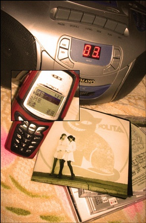

 回家将近一个月了 在朋友基本都上班了的年头 算算好像一个月的假期……的确很久了 和往年一样 假期快结束的时候回望假期……我还是什么都没有干 我和我妹说：假期什么都不干才是正事 事实上这话都不能使自己安心 家里真是一个待得很舒服的地方 舒服到我什么都不想做了 就这样待着 待着 待着 待着 实在没事的时候 人就会开始回忆 坐在屋子里回忆以前的事 然后决定翻翻以前的信件，照片，贺卡…… 听着以前夜里习惯听的歌 有时候突然从回忆的思绪中挣脱出来时 我仿佛还是当年中学时代的那个我 那个应该是时候上床睡一觉 明天6点多起来骑车上学的我 那些年的事情仿佛就是昨天 身边的书桌，书柜都没有变 没有镜子 似乎我也没有变……