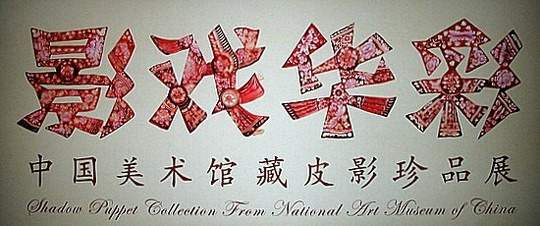

 6月1日儿童节，我们看了皮影展。 “一口叙说千古事，双手对舞百万兵”，皮影戏以其独特的表演形式成为中国民间艺术天宇中极为璀璨的一颗明星，千百年间，影戏曾经华彩勃发，领尽风骚。不过在娱乐形式多样的今天，的确没什么人看了。展览的标志海报做得很漂亮，图如下，让我想到了前年春晚一群老太太的那个舞蹈。 皮影戏融合了镂刻、绘画、音乐、戏曲等多种艺术。但我感觉在绘画和镂刻上艺术性要大一些，那些烦琐的花纹太好看，和现今流行的烦琐的装饰插画风格一样吸引我（很大原因是我自己画不出来，所以比较崇拜-_-）.至于音乐和戏曲，的确表演的所有音乐和音效都是那几位师傅在后台现场制造的，有出色的口技，一个大叔在那吹口哨模拟很多只鸟。不过我个人觉得那个音乐实在不好听，吵得很，坐在第一排中间的一位女士，天真高兴地看着舞台，但双手捂着耳朵。旁边还有几个小朋友。我想这些曲子大部分都是给小朋友或者大朋友表演的，音乐是不是能与时俱进一下呀，起码那么多年了，总该有些发展才是嘛。而说到“双手对舞百万兵”，的确看到师傅们表演“儿童踩高跷”的时候，是四五个人表演七八个角色，不过那动作也实在太模式一点了吧，都没有太多的变化。以现在的技术水平，在道具上应该比以前大有改进才对，那支点应该多几个支撑人物的关节部位，这样才能创作更多的动作，不然总是觉得那个小人贴不紧布幕，遇到复杂动作的时候总是含糊带过，离布幕远了，影子也不清晰了。 总之我觉得皮影戏应该可以搞得更好。那些师傅们是不是应该开拓一下，不然真的是慢慢只能放进博物馆了。相对来说还是很喜欢皮影戏的画。 PS:  看完展览出来，我想一个问题，皮影戏……能不能有人物不是用的侧身影呢？