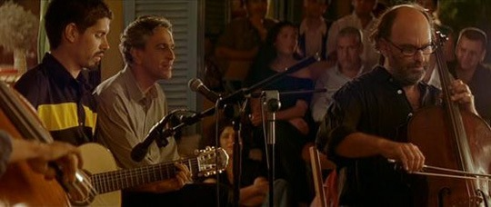

 近日看了阿莫多瓦执导的电影《对她说》。看的时候有点困，但不影响我坚持把电影看完，这一切当然归功于这部电影本身。电影的精彩看过的人已经说的够多的了，没看过的我只能说一句：推荐某天你静下心来的时候，值得一看。毕竟我远不是一个阿莫多瓦迷。 除了电影本身，估计大家谈论最多的就是这部电影里的音乐了，在我听完整张OST以后，准确地说，大家都应该只是热衷谈论里面的一首歌。就是《Cucurrucucu Paloma》 —— 翻译过来就是《鸽子歌》。在电影开始的很长一段时间里昏昏欲睡的我，就是被这一幕唤醒了。那一幕，我们的男主角靠在一边，和周围一圈的人一起静静的听着巴西著名歌手Caetano Veloso演唱着这首《鸽子歌》。（阿莫多瓦拍摄《对她说》时，突发奇想，邀请Caetano Veloso出镜，在电影里亲自演绎这首歌曲） 这两个男人在一起的这个画面将永远印在我的记忆里。男主角，一个长得不帅还有点秃顶的中年大叔，电影里老时不时掉个眼泪，弄得他身边的人觉得他感性，而我自己一直认为他只是眼睛有问题，没想到他是真的流泪，当他带着一双寂寞深邃的眼睛听着这首歌的时候，他和女朋友说：听到这首歌，我有点潸然…… 那时候的眼神应该让很多人都忘不了。而那个巴西的中年歌手，唱了开头两句，我原以为肯定又是一首很主旋律的世界名曲什么的之类，没想到突然声音一降，接下来两句立刻直入内心，声音虽低但特别稳，叠在安静的背景上，显得如此的简单直接，一种感伤寂寞的情绪立刻充满我的内心，我忽然也想说：听到这首歌，我有点潸然…… 鸡皮疙瘩都起来了，这个巴西歌手轻轻碎碎的肉麻声音，竟又不令我讨厌，我想“老闷骚男”这个词是不是就是用来形容他这样的。就这样两个中年老男人制造了比许多帅哥都要经典的场面。 随后立刻下了这首歌一听，先是下了一个应该是原始的版本的吧，编曲轻快，唱的人也轻快，我想我要是先听到这个版本肯定就是一听就忘，编曲和歌唱在这个时候显示出作用来了。忍受不了，立刻删掉下了电影的OST，听了好多次那位闷骚男轻轻地学鸽子叫，不禁我又有点潸然…… （PS：歌曲作词作曲者墨西哥人Thomas Mendez，作于1956年。由于极受欢迎，现已成为墨西哥民谣，曾被许多歌手重新灌录，包括巴西著名歌手Caetano Veloso.王家卫也用过这首歌，就是杜可风那段著名的伊瓦苏大瀑布摄影的背景音乐） 附上歌词：

人们说晚上他会彻夜哭泣 人们说他食不下咽只顾喝酒 人们发誓上帝听到他恸哭也会颤栗 他为她受了那么多苦 即使在他临终时还呼唤她的名字 他如何歌唱 他如何歇息 他如何歌唱他死于致命的激情 忧伤的鸽子一早起来唱歌 飞到那间孤独的小屋前 小屋木门大开 人们发誓那鸽子定是他的魂魄 他仍然等着她 等待那可怜的女孩回来 我的鸽子不要哭 石头永远不会知道 我的鸽子永远不会知道 爱情是什么……