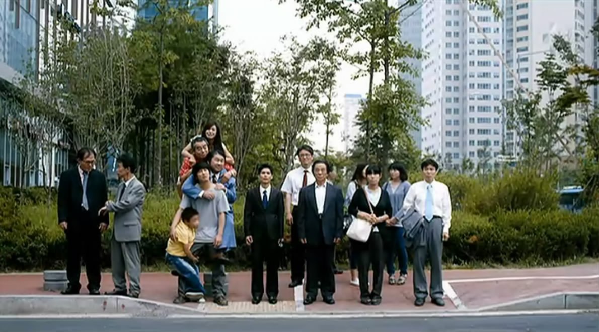
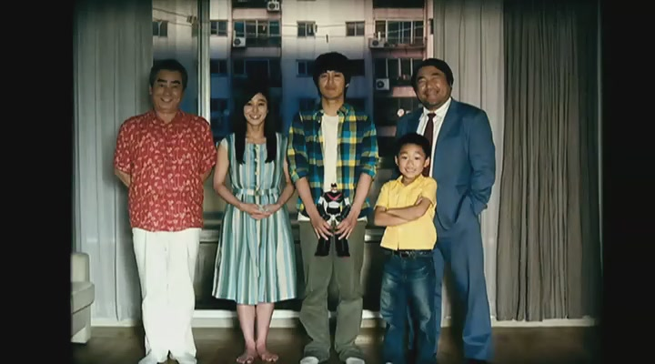
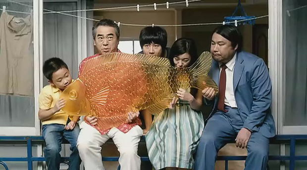

 多亏同事推荐电影给我的时候没有剧透，只当这部车太贤的《开心鬼上身》是部彻头彻尾的爆米花片，前面也都轻松愉快，时不时有些小笑点，但最后突如其来的煽情真是始料未及，连我这样阅片无数的老影迷都被煽得声泪俱下，哭完想想又觉得好笑，觉得自己怎得如此大意，一不小心就被煽了情。 一直以来都不怎么待见煽情片，主要大多煽情片煽的手段太烂，以为一味地表现凄惨就能博取同情的眼泪，或者时不时刻意地给个煽情的镜头，提示你这儿该哭。这种眼泪很廉价，看得多了，自然就免疫了。一部有技巧的煽情片懂得让你笑中带泪，泪中带笑，懂得先卸下你的防备，然后再玩你个措手不及。  《开心鬼上身》前大半段故事，就是一普通的搞笑片，虽然也在想这几只鬼应该互相之间有些关系，但从他们各自的愿望中还真找不出什么关系，甚至每个人的愿望都有些无厘头：色鬼是要找一架相机，烟鬼是找辆车去海边，小孩是买好多好玩好吃的，爱哭鬼是给最爱的人做饭。虽然知道主角是孤儿，从小在孤儿院长大，但只当他是弃婴，这个错觉根深蒂固，让我在看的过程中丝毫没有怀疑人生。水芹菜换回记忆的一瞬间，我甚至还在笑说，鬼还没走，还在用他的身体说话。结果，记忆中母子的画面一出现，我才恍然大悟，一部泡沫剧陡然升级成一部温情催泪片，剩下的就是以泪洗面边哭边笑了。  很爱这只大糖鱼，原来韩国也有“转糖”这东西，不过他们是用飞镖扎转盘，好像难度更高，难怪作为大奖的鱼那么大个，老板把鱼递过来的时候还一脸的不乐意。话说韩国人还真是很喜欢鱼啊。老家那边叫“转龙”，顾名思义最大的奖是一条龙，但比起这条鱼来，实在小太多。我记得小时候我只转到过一两次龙，据说是转盘底下有磁石，让你根本转不到龙。大多数时候我都是花两毛钱直接买一坨麦芽糖，拿两只竹签绕着绕着再舔一口，小时候叫“搅搅儿糖”。后来作为大奖的龙可以直接花高价买了，有钱人家的孩子就直接买了龙得瑟，游戏也变了性质。