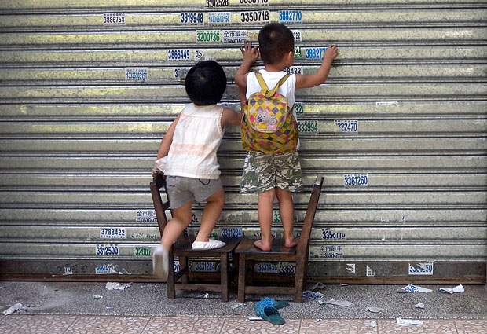
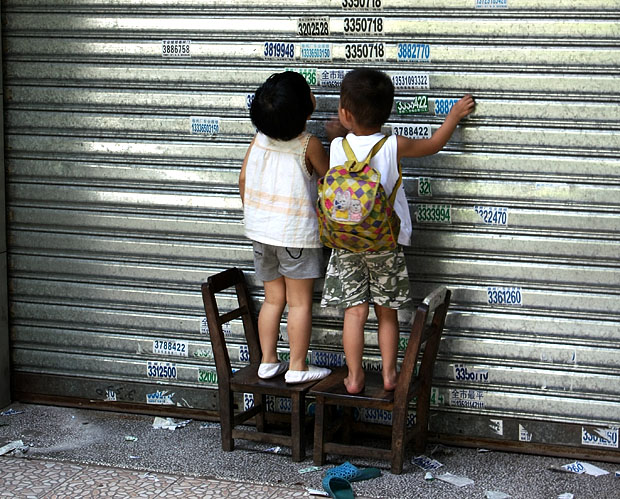

  国庆在湛江街上晃荡。由于过节，许多小商铺都关门回去探亲访友了，我们特意慕名而去的一家甜品店也是这样，卷闸门都关着。无意间看到一对小朋友，拖着两个小木椅在街上走着。拖到一店铺门前的时候，俩人停了下来，把小木椅摆好，爬上去开始撕贴在卷闸门上的垃圾小广告。这一幕顿时让街上温馨了许多，我们看到的人都心生欢喜，却又不愿意去打扰。看着他们安安静静的，我们心里竟也感到幸福和满足。 因为没有时间盯着这两位到底要撕多少家小广告，所以我看了看周围，没有大人跟着，便在背后给两位小朋友拍了照。不知道他们长大了以后，会不会想念当年的小伙伴呢。