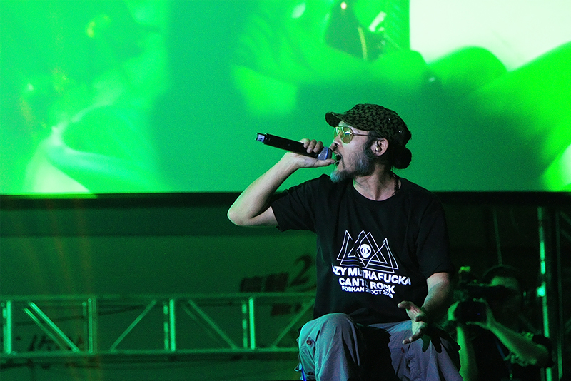
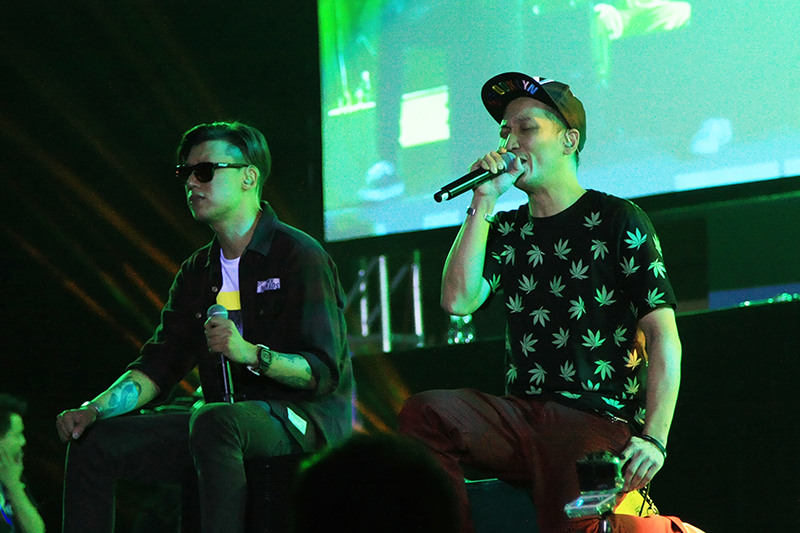
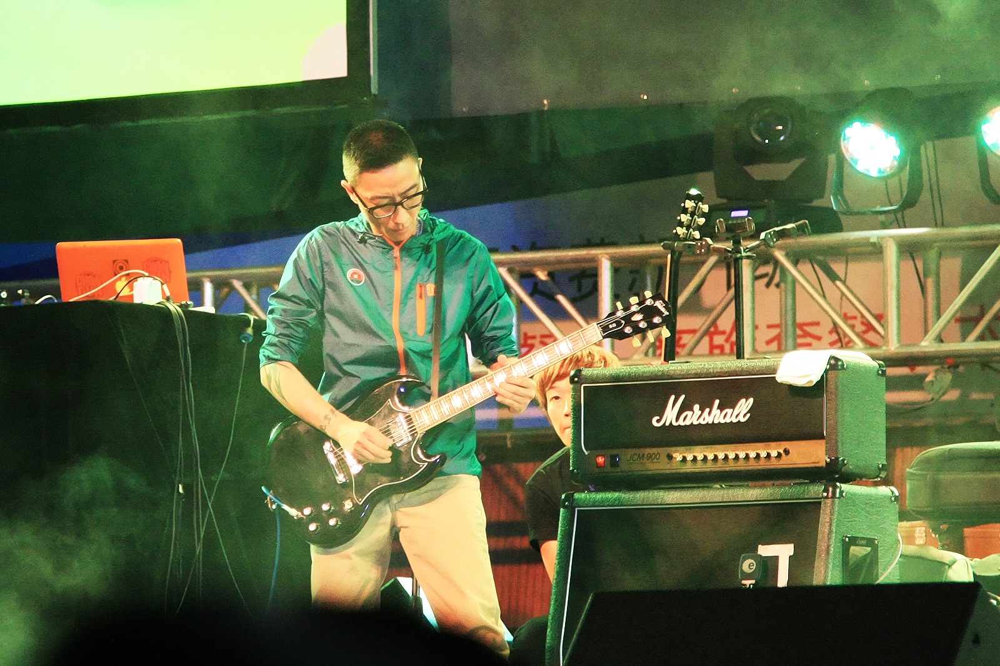

 其实不管从哪方面看自己都不像是一个听Rap音乐的人，在高中的时候我也基本是个品学兼优的学生，很难想像会和粗口音乐有所关联。这和昨天坐我身边的18岁女生不一样，她读的广州一所中专，她说自己是早几年对人生感觉很灰的时候，受朋友推荐听上了大懒堂。细究起来这也许和我隐藏得较深的本质有关。总结起来就是：我从来都有机会混入这个社会认可的上层，和那些所谓精英一样。但每当人生遇到这样的契机时，我内心就会抗拒退缩。一种强烈的草根性让我很抗拒去做一些改变，而希望待在一个相对屌丝的环境，也像是歌里唱的“屋邨仔”吧。 昨天演出时身后一位哥们喊：“老了，跳不动了，前面的朋友坐一会吧”。不管是台上的，台下的，大家都老了。年轻时心中那团火，还能保持多久呢。原本我并没有计划去佛山看大懒堂内地首演，但去了之后觉得真是无憾。原本以为自己会和以往一样安静的看完演出，没想到真的和他们一起唱了跳了起来。那种感觉很释放，原本自己个性里也有这样一部分特质吧，但从来很少释放表达过，也受益于昨天周围没有认识我的人。 演出回来，看到佛山很多学拳的孩子；还有中国散打冠军与泰拳冠军比赛的海报，票价不菲；路边还有一些咏春拳馆，这让我隐约感受到了叶问，和黄飞鸿的余风。并回响起那句歌词：“要真正表达你本质，至系最积极既武德！”。 \[su\_row\] \[su\_column size="1/2"\]\[/su\_column\] \[su\_column size="1/2"\]\[/su\_column\] \[/su\_row\] \[su\_row\] \[su\_column size="1/2"\]\[/su\_column\] \[su\_column size="1/2"\]\[/su\_column\] \[/su\_row\] \[su\_row\] \[su\_column size="1/2"\]\[/su\_column\] \[su\_column size="1/2"\]\[/su\_column\] \[/su\_row\] \[su\_row\] \[su\_column size="1/2"\]\[/su\_column\] \[su\_column size="1/2"\]\[/su\_column\] \[/su\_row\]