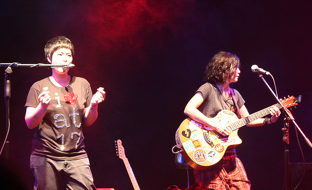
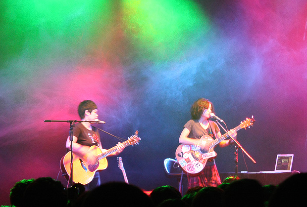
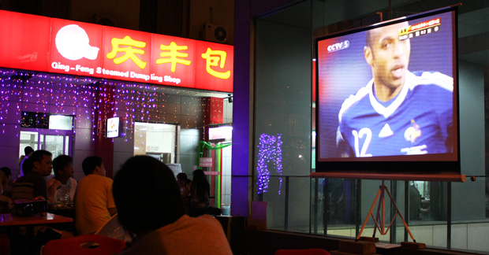

 6月看了今年第一个演出，at17在星光现场。一直很少机会去看现场演出，演出的门票在我这个阶层看起来总是奢侈的行为。当然也不是花不起，但还是要挑过选过才能决定。我希望有一日，那几位能让我不计成本的乐队音乐人，能来我所在的城市。  五颜六色的背景烟幕挺浪漫，让你更能沉浸在当下。忍不住就跟着大家瞎起哄。  弹吉他的样子还是很投入的。忍不住再放一张。  回家的路上，在路边的庆丰包子铺，看到了不久之后就告别世界杯的亨利。包子铺的老板挺会做生意的，晚晚投影直播世界杯，每天都客满。