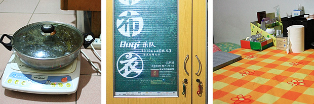

在这房子住了一段时间后，觉得空间利用上还是不够合理。于是我们决定开始重新布置空间，当中改变的细节很难描述清楚，那份欣喜和愉悦自己牢记就好。其中最大胆的就是把原来一个梳妆柜拆成了两半，塞到壁柜里面去了，尺寸大小刚刚合适，实在太运气了，一下客厅就宽敞起来。而且梳妆柜在壁柜里面，也把许多之前用不到的空间丰富起来，很多不常用的东西都塞到壁柜里面去了。  这是最后弄完的效果。平日基本的娱乐都在这两个工作桌上完成，这两宜家的桌子比较大，也很结实，电脑，录音设备等全都能摆得下。其实它们的真实身份是餐桌，但我们觉得比别的办公桌都合适，最后就选了这款。屋里没有电视，还好现在网络发达，在线看节目都很方便，不会耽误什么。两个工作桌底下放了两个地毯，是在对面的天丰利市场买的便宜处理货，放上去后再搁几个整理箱，又增添了不少储物空间，底下藏着书，杂物，和平日的零食。这样改变了以后，桌子前面那块比以前省出不少空间，我们在这玩个跳舞毯，做点简单的运动都没问题。  上面是窗台，在暖气片上架两块木板，又可以放很多东西。右边是床，想着有时候会躺在床上看会书，所以这边把以前办信用卡送的DVD机拿出来，配上一个小音箱，配上暖黄色的台灯，马上感觉就不一样了。除了平时边看书边听音乐，周末早上赖床的话还能用音乐把自己唤醒。别的地方放些最近看的书,CD,和玩偶，仔细看的话会发现窗户还贴着透明胶。那是因为原来是两层窗户，很暖和，但是前年夏天发生了“[被吹落的窗玻璃](http://www.coletree.com/podcast/2009/07/26/)”后，就剩下一层玻璃了，冬天寒风搜搜地往里窜，我们只能用透明胶把窗户缝全堵上。  左：床脚有个小空地，布了线，能在这用电磁炉煮点东西。 中：布衣乐队亲笔签名的海报，拿回来装饰在老衣柜上，“布衣”，还挺切合主题。 右：老的旧书桌被放到床脚，可以放不少杂物，也能稍微档一下床。 这个房间还有一个值得一提的大好处就是有两个很大的壁柜，藏在墙里面，就不上图了。我们的许多杂物箱都能堆在里面，让眼睛看得到的地方还能保持相对的简洁。目前这个空间我们还挺满意，但也许以后看腻了，或有更好地点子，也不排除继续折腾的可能。我们都开始喜欢上了这项娱乐：）这老房子虽然也有不少问题，但总体说来住的还是挺高兴的，我想最重要的是心态。