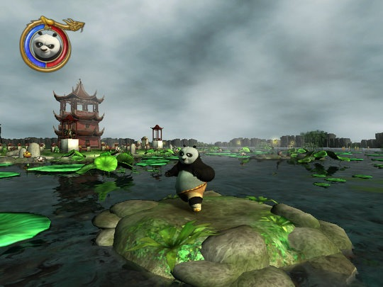
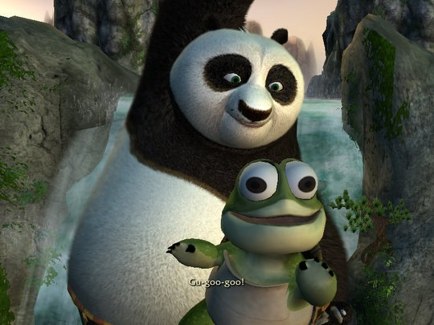
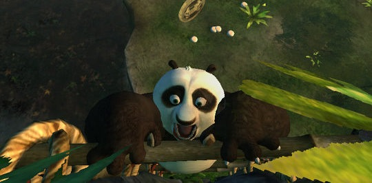
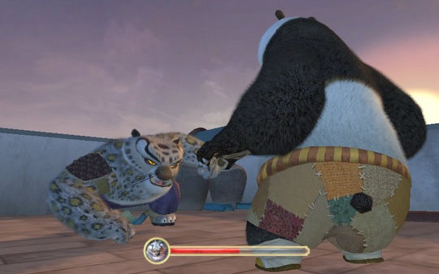
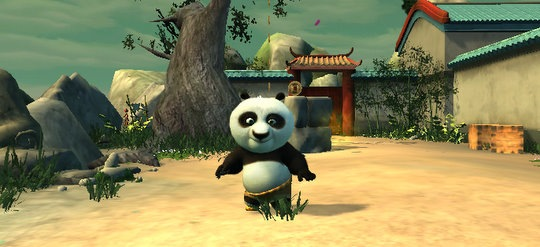

已经一周没有下雨了，天气炎热难耐，很是怀念前一阵子的雨水，小树同学于是很肯定的说那是人工降雨，为的是奥运前冲刷一下这个脏脏的城市。如果真是的话，那接下来这周肯定会降几次吧，管他是不是人工，能下就行。 周六经过首体，看见排队买奥运票的人足足有两三百米，五六辆警车守在路中间，这么闷热的天，真是不容易啊。 周日哪儿也没去，在家通关了《功夫熊猫》，真是轻松又好玩的游戏。最喜欢熊猫傻傻憨憨的金鸡独立状，因为身体太胖了，每次独立，它都会自己不停换脚。玩鳄鱼潭那关的时候，我总是从荷叶上跳不过去，Po就不停地落水，每次落水发出的声音还不一样。可以说，不但电影里的笑料一个不少，还增加了更完善的情节和更多的趣味。只想说，电影好看，游戏更好玩。放上截图几张，同大家分享了。     最后一张是通关后发现可以通过秘籍把熊猫改成大头，效果如下，一看我就乐 