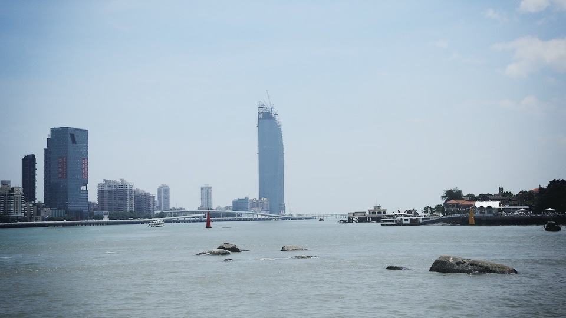
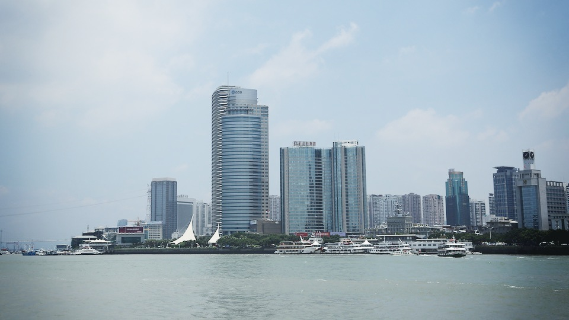
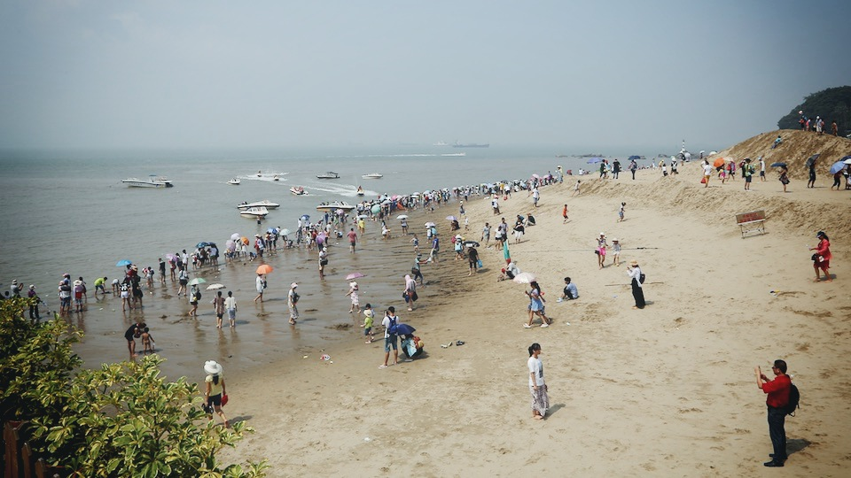
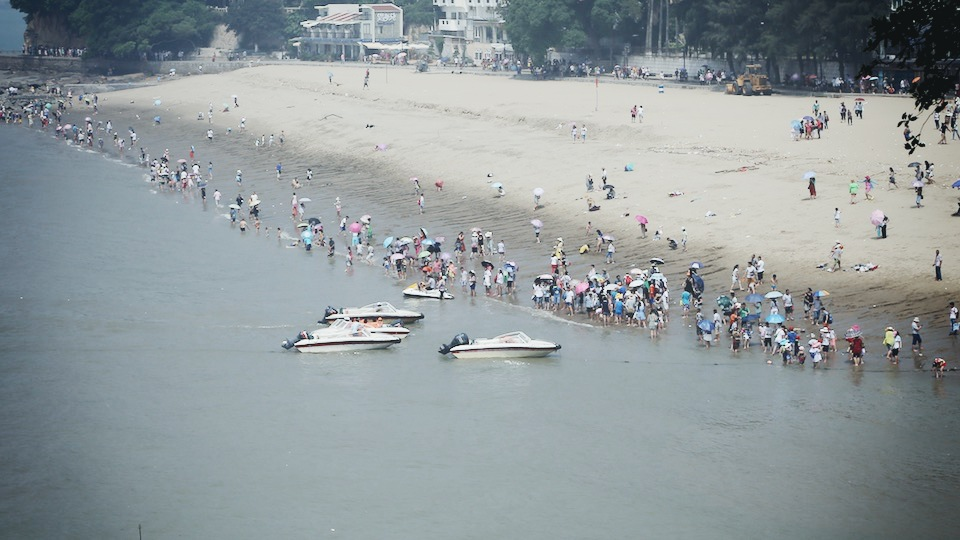

厦门鼓浪屿的海并不是很蓝，暴晒的太阳也让游客不愿意到沙滩受累。这里的海并不干净，人却很多，只有在远离港口的岛的一端，稍稍能坐下来，感受下微微海风和轻轻拍打礁石的海浪。小岛的宁静不语被汹涌而至的人潮打破后，走在岛上的心情便也和扑面而来的热浪一般焦灼了，实在谈不上休闲。倒是回头看这些照片，才能重新找回当时丢失的那份惬意，时间成了滤镜，滤掉了喧嚣的人声，热烘烘的汗味和烈日下暴走的身影。     