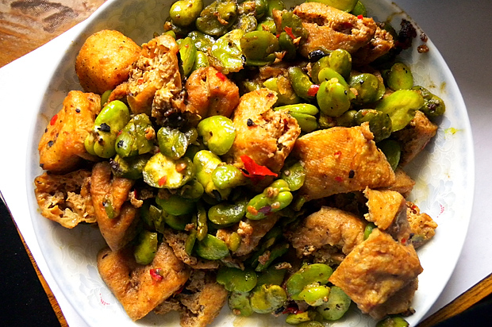

 记不清几个月没进厨房了。偶尔也熬个粥，煲个汤，但炒锅真是很久不用。这几天赋闲在家，本来也没想用灶台，可前些天买的蚕豆米，中午用微波炉蒸锅蒸太久，看着蔫蔫的，好难看，只好拿出好久不用的炒锅再加加工。虽然总嫌灶台太脏，还是忍了，想也许过不了多久就要搬家，把橱柜里剩的食材赶紧用完才是要紧事。倒上前些日子买的小瓶装炒菜油，放上香辣豆瓣酱，又切了几块豆泡扔进去，撒上一点鸡粉，还在锅里，闻着就香，出锅一装盘，这颜色，立马觉着好吃了。原来炒菜这事还是不会生疏的，暗自窃喜，却忘了房间里煲着的粥，回房间看的时候，电饭煲噗噗地冒着气，地上已经积了一小滩溢出来的粥……