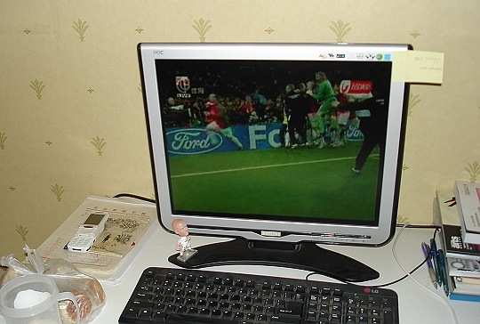
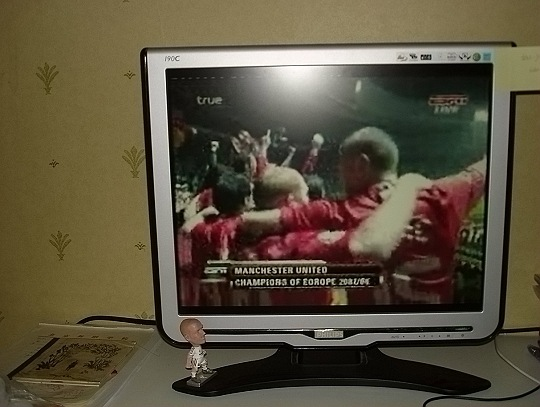

这场比赛太刺激了，心脏稍微不好都不行，不枉我熬夜通宵。 C罗罚丢点球的一刹，都快绝望了。最后看着特里脚下打滑，实在是天意啊！C罗罚丢点球以后在队伍中象犯错的学生一样苦站着，要是输了，估计他自己内心要折磨一段时间，会不会又变成众矢之的。庆幸最后我们赢了。99年后再登上顶峰。这种兴奋和激动已经很久没有再尝过了，也多得这场比赛如此惨烈惊险。 07-08赛季，以曼联和切尔西对阵开场，当时也是点球； 07-08赛季。同样是以这两个队伍比赛结束，也是点球。 留图两张，给这个通宵后的清晨一个纪念。  