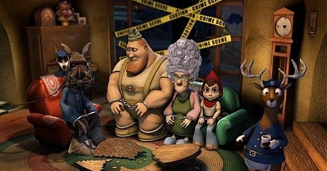

 天气晴好，心情也跟着舒畅。这种时候不愿意想太多所谓深刻的东西，轻松愉快就好。前几天看了安妮海威瑟的《成为简奥斯汀》，自然而然想起了前年由她配音的3D好莱坞动画《小红帽》，副标题是《欺骗！小红帽的真实故事》。一看这个题目，你就该知道这又是一部颠覆传统童话的作品。 此类作品在好莱坞其实早已司空见惯，之前有《海的女儿》、《巴黎圣母院》，还有名声大震的《怪物史瑞克》系列（尽管看过2之后，我就再也不期待它的3）。《小红帽》也不过是追随这批颠覆潮流而出现的又一部动画片。但似乎“大话”、“恶搞”之类的作品，即使有泛滥之势，其中的经典作品还是永远也不嫌多的。在我看来，《小红帽》比《怪物史瑞克》还要略胜一筹。 故事发生在我们所熟知的“小红帽”童话的结尾。青蛙侦探奉命调查发生在老奶奶家骚乱事件的真相，嫌疑人有四：功夫少女小红帽、新闻记者大灰狼、扮演伐木工人的演员、极限运动高手老奶奶。光是看了这几个著名人物的身份，就已经让人大跌眼镜，影片还更是借用了“罗生门”式的四段式回放叙述法，搞得青蛙侦探跟一正经大侦探一样，末了断案成功，还不忘加一句颇含哲理的话“如果森林里倒了一棵树，那起码应该听取三方意见，你的，我的，那棵树的”。 影片极尽恶搞之本能，光是几个人物的造型就够搞怪的了。最难看的当属小红帽本人，五角星型的脸，配上两颗鹅卵石般的大眼，就算她的配音安妮海威瑟眼睛大，也不能这么大吧；老奶奶的头发堆得跟烟囱一样高，大灰狼一身记者装扮，还带着一只负责拍照的小跟班松鼠，松鼠一喝咖啡说话就极快，不得不录下来慢放；手持斧头的“伐木工人”却是个胆小不自信的演员，壮硕的身材，却头顶一只小得可怜的帽子。 影片用了多种音乐元素，乡村、摇滚、爵士、蓝调等等都可以在片中找到，值得一提的是只会唱歌不会说话的山羊，任何语言到了他那儿就只能唱出来，他还经常把自己的山羊角挂在树上荡秋千。 再说就没劲了，这样的影片不看实物实在是无法体会到它能带来的快感，赶紧回家下一个吧。