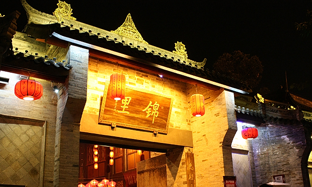

 过年回家之前，去了一趟圆明园的皇家庙会，结果很是失望。桃花是假的，迎春花也是假的。不知道是不是我们去太早了的缘故，号称皇家庙会，结果除了几张清朝八旗文化图片，几个表演吹糖人，画糖画，捏面人，毛猴，草编的民俗摊，博物馆里展出着清朝服饰，剩下的就是北京各大庙会必有的儿童游戏嘉年华和一长溜没啥特色的小吃，不外乎羊肉串，炒肝、灌肠、爆肚、褡裢火烧这些东西。皇家活动斗鸡表演光看一眼都要花钱，果然是贵族项目。算起来在北京逛过三次庙会了，前两次在地坛和朝阳公园，虽然比这次皇家庙会要好，但也没什么值得留恋的。 过完年去成都，按计划去锦里，碰巧遇上锦里和武侯祠串一块儿搞成都大庙会，门票20，算下来比平时单独去武侯祠都要花上60便宜多了。说到门票，不得不批判一下川内景点的高价门票，基本上只要是古迹，不管大小，都在60以上，像都江堰这样明显应该作为小学生历史文化教育基地的景点，哦，在天朝我们习惯称之为爱国主义教育，这种去一次就够了的地方，居然已经涨到90，而且进去发现包括二王庙在内的所有庙都还在修，只有安澜桥还能寻找下儿时的回忆。 不过锦里真是超出我的预期。之前听很多人讲去锦里不如去宽窄巷子。去年回家已经去过一次宽窄巷子，诗人们开的酒吧餐厅总让我有种到了798的感觉，尽管他们是如此不同。 去锦里是在晚上，在窄窄的石板路上穿行，满眼的红灯笼映在潮湿的路面，有些摇曳。有几家卖三国礼品的小店，里面的公仔让我俩流连了好久，买了诸葛亮和一对卡通皇上皇后，剩下个关二哥的储钱罐，犹豫了好久最后还是嫌贵没有买。在小吃街胡吃海吃了一番，又去湖那儿看了半天黑天鹅，就已经快10点了，店铺开始打烊，店家一个个举着门板安回门框上。两小时太短，没过瘾，于是第二天一早又去了一趟，再花了20块钱，把武侯锦里逛了个遍，却还是留了个遗憾。那个关二哥的储钱罐，最后还是没买，后来发现锦里这里卖的是最便宜的，第二天去洛带和宽窄巷子都比这儿贵。有遗憾也未必是坏事，至少有这样一个地方让你想再回去。