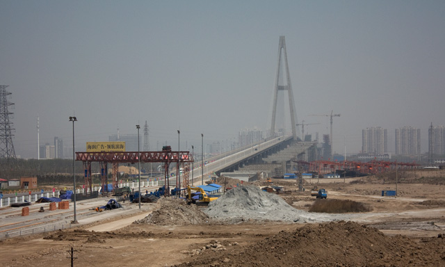
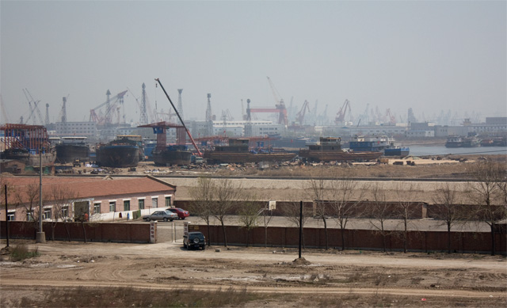

天津从地理上讲也是个海滨城市，至少塘沽区是滨海的，只是天津市区离塘沽还有点距离。这次去天津，却感觉到它不像一个海滨城市的样子。虽然接下来我的感受会有偏颇之处，毕竟我只是匆匆走过一遭。不过这是我的直接感受，应该也能反映出一些普遍问题。 我们这一路火车过去，看到天津铁路两边许许多多的工厂，厂房，烟囱，果然是传说中的重工业城市。当天还是非常晴朗的，你仰头看头顶的天还是蓝的；但一眺望远方，你就发现城市高楼都被灰色的浮尘围绕着，也许是煤灰什么的，都是那些工厂惹的祸，空气污染挺严重的。而且也没有吹到海风，更没有海风经常带来的海上腥味。总之，很难感觉自己是在海边。在塘沽的港口，放眼望去，大片的的起重机，港口吊机，底下的工地尘土飞扬，一切都在建设中，却不知道都是一些什么项目。在我们去的地方，也没有看到能让人行走的沙滩，地上许多泥潭，长了许多芦苇草，一时间有些失望。也许在塘沽靠南的海边会好点还是怎么样，只能以后有机会来再看了。 海滨城市另外一个吸引人的地方就是海鲜。但我们在天津市区里的饭店看到大部分放在门口的海鲜都是死的，店主习惯用几块大冰块扔在泡沫箱里保持仅有的鲜味。一般只有皮皮虾和小龙虾活着，而这两者我一直都觉得没什么吃的。饭店里的消费似乎也不便宜，整体下来让我感觉在这里吃海鲜非常不划算。 天津城区也挺大，毕竟是直辖市，比许多二线城市要大得多。但它的现状似乎跟它的地理位置一样尴尬，离北京太近不知道是一个优势，还是劣势？这里虽然繁华，但还比不上几个一线大城市。如果作为一个海滨优美中小城市来看它呢，它的环境又是相距甚远。这时候我又会想到我的老家，一般的经济实力，不繁忙的港口，名气不大，游客稀疏，还有一句土话“工厂都不冒烟的”。只是有很好的空气，很好很便宜的海鲜（是全国首个海鲜美食城），很好的绿化，这是不幸还是幸运？目前湛江岛上两个重型项目已经在建，但国家因为产能过剩还没有最终批准，未来不知道会怎么样。  