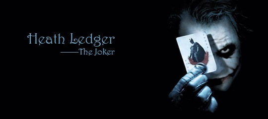

 周日一出门就下雨，本来要去踢球的小树也只好跟着我悻悻回家。 窝在家上网逛豆瓣，才极其后知后觉的知道了一则旧闻。原来《蝙蝠侠前传2：黑暗骑士》里小丑的演员希斯莱杰年初因过量服用安眠药死在纽约的家中。《黑暗骑士》也因此成为他的遗作。而希斯莱杰同时也是《断臂山》里恩尼斯的扮演者。可我看完整整两个半小时的《黑暗骑士》，愣是没看出小丑就是恩尼斯。 一直对于美国漫画改编的非人类个人英雄电影不是很感冒，但最近却破天荒地接连看了《地狱男爵2》，《钢铁侠》，还有这部《黑暗骑士》。第一部，记住了地狱男爵和鱼人的深情合唱《I Can't Smile Without You》。第二部，喜欢上了小罗伯特唐尼，期待他演的福尔摩斯。第三部，竟毫无预期地成为了心中的经典。 一部分是因为完美的剧情和特效，另一部分则是因为角色的力量，而其中最大的亮点当属“小丑”，他的一言一行，他的存在给这部电影增加了哲理般的黑暗诗意。他就像藏匿在人群中的一张“小丑”牌，你永远不知道他会在什么时候跳出来，赤裸裸揭穿你内心想极力掩盖的黑暗人性。他更像看透世间虚伪的一个斗士，永远带着让世人发怵的笑脸玩弄着所谓正义。他狂妄，肆无忌惮，却又机智过人，思维慎密。影片最后那场船上的博弈高潮，我想要是放在现实社会，肯定还是会按“小丑”的推测残酷收场。而影片中的小丑却迟迟未能等来自己期待的焰火，第一次一脸惘然。 小丑的故事就此落幕，正义的一方却只能掩盖真相，被小丑引诱的双面人也终以好的一面示人。突然感觉一阵悲凉。想到这个世界，又有多少表面的和平底下掩盖着罪恶的真相。 小丑走了，黑暗还在继续，只是少了一个人让我们直面这些黑暗罢了。 希斯莱杰走了，娱乐圈的浮华还在继续，只希望明年的奥斯卡最佳男配角能给这位我们心中永远的“小丑”。