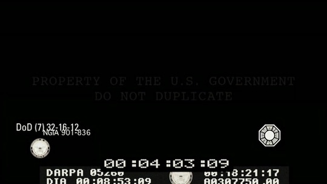
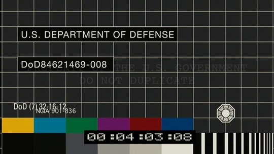

推荐两部电影：《[葬礼上的死亡](http://www.douban.com/subject/2003389/)》和《[苜蓿地](http://www.douban.com/subject/2144242/)》。 前一部是标准的英式黑色幽默片，喜欢这类型片的朋友可以找来看看。情节设置新颖，虽说有些场面会让人感觉很混乱，但整体而言，充满了别样的英式小趣味，高潮段还能给人一点小感动，片头片尾动画也挺别致，适合带着放松的心情看，看完一定让你心情愉快和温暖。 之所以说它小趣味是因为有后一部影片的精心设计做对比。和后一部比起来，前一部电影就只是一碟饭后点心。 好早就留意《苜蓿地》，去影院看《变形金刚》的时候，预告片时间赫然蹦出无头自由女神像，又一部纽约遭殃的灾难片，但当时完全不知道会是怪兽有关的片子，更不知道《苜蓿地》出自曾创造了Alias，Lost的著名J.J.Abrams之手。只看上映日期是2008.1.18，就心潮澎湃，因为那天是我生日。 直到最近，才终于领教了这部影片的厉害。全DV记录的第一视角拍摄模式，真实地让我好久没有如此紧张地看一部灾难片。单就情节上来说，这部影片还真是没有新意，但拍摄方式和让真正喜欢的影迷场外互动的模式，可以说开创了电影的一个新Era。所以说《迷失》的主创真不是盖的，一个lost就让好多影迷心甘情愿在时间线，神秘研究组织，和神秘数字之间lost了（包括我），这次这部看似小成本不经意只用DV示人的怪兽片，却同样隐藏了太多秘密。于是有人研究影片中向其他怪兽片致敬的彩蛋，有人研究结尾的神秘影像和声音，有人研究与其相关的几个神秘网站，还有人研究几个演员的Myspace网站，发现最后登录时间都是2008年1月18日。这真是一部有策划有预谋的片子，不愧是爱玩神秘的JJ的Project. 流连在各影迷的分析文字之间，我又赫然发现了一幅影片开头的截图：   看右下角的标志，看过Lost的朋友应该都认识，是里面著名的达摩组织的LOGO。难道说这部片子还真的和Lost有渊源？ 晚上趟床上想了很久，达摩在这里面到底扮演什么角色，如果这样的话，这部片子的时间线是不是又要仿照Lost去思考，DV里面倒是有很多闪回情节，会不会同Lost里一样隐藏着什么新信息。 没想通，然后就睡着了。 看来JJ这套故弄玄虚的玩法对很多像我这样的人还是很受用的。这部电影，不推荐有眩晕史的朋友观看，其他人，我觉得，即使你不会像我那样去到处收集研究心得，也大可体验一下第一视角影片带来的冲击力。