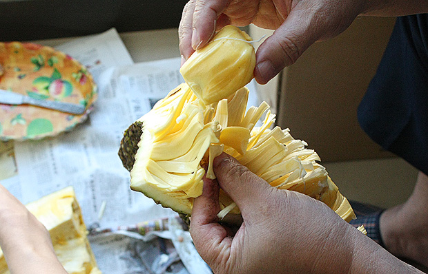

 国庆老爸从老家带了个大树菠萝过来，就是菠萝蜜。菠萝蜜隋唐时从印度传入中国，称为“频那挲”（梵文Panasa 对音），宋代改称菠萝蜜，沿用至今。北京这边常见的那种菠萝我们老家管叫“麻子”。而菠萝蜜才是我们那边常说的菠萝。菠萝蜜是世上最重的水果，不大好带。这只到达北京时已经散发阵阵清香，正是待剖的时候。  先一刀劈两半，里面的果肉一下都暴露出来了。  接下来要把一个个金黄色的包从粘粘的纤维中挖出来，挖的时候最好带个塑胶手套。不然最后洗手的时候很麻烦，太粘了。  解剖完毕，成果如上。这么一个菠萝有几十个包可以吃，有些大的菠萝能够有100多个包的，真是够你吃的。菠萝蜜的营养价值很高，含有碳水化合物、糖分、蛋白质、淀粉、维生素、氨基酸以及对人体有用的各种矿物质...具体的请自己百度一下。  菠萝蜜全身都是宝，吃完每个包的黄色的果肉，里面的果实也是可以吃的，一般用煮花生的方法，直接放热开水煮熟，即可以吃用。好的果实吃起来是粉粉的感觉，实在是美味之极。但如果长芽了，就基本不能再吃了。 全身都是宝，那大树菠萝的叶子有没有什么用？菠萝树的叶子是我们当地包“籺”（籺的发音为，粤语就念类似微博的@，如果是普通话的就念hé，用全拼和搜狗输入法就很容易打出来了）的好材料，可以令籺的味道更清香，增强口感，也给籺提供更充足的营养。以前每年春节，奶奶就要自己在家做籺，就会提前叫我和我爸在单位里的菠萝树上摘一大堆叶子带回去。后来奶奶腿脚不行了，不再自己做了，我们春节前才少了件事。