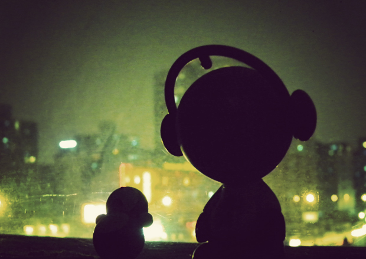

 因为地球一小时活动，我们早早就睡了，一觉睡到大天亮，算是超额完成了活动任务。想古人不正是这样日出而作，日落而息，在电灯发明以前，也不大会因熬夜而生诸多疾患。其实这样的环保活动，最该参与的是那些富人，而不是像我们这样没车没房，租来的屋里只有一盏节能灯的普通人。还好，晚上8点半经过三环边一座光鲜亮丽的摩天大楼时，亲眼目睹了它熄灯的一瞬，算是欣慰。不过，一直觉得，像这样的大楼，在这座城市随处可见，真的有必要在平时下班后和周末晚上都一直亮着所有的灯么？如果只是为了这个活动而熄掉一小时，那又有什么意义？