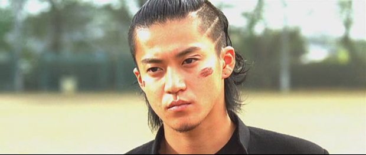

乌鸦高校2/热血高校2

 我得承认，这片子看得我血脉喷张外加花痴泛滥。豆瓣上有人说“没想到我一把年纪还是很爱看古惑美少年打群架 ”。这话也正是我想说的。感谢三池大叔，时隔一年半，在上一部剧情将忘不忘之时，适时推出了第二部。希望接下来还有得看，有得盼。据说这两部是漫画版《热血高校》发生之前的故事，相当于前传，不知道是不是为了拍正传先来点铺垫。  小栗旬饰演的源治，只身一人单刀赴会，决心与凤仙学院决一死战。暮然回首，包括芹泽军团在内的铃兰高校众弟兄已经浩浩荡荡出现在身后。那一刻我身体里住着的那只乌鸦也觉醒了。  虽说是青春暴力，但纯粹到只用拳头解决问题的暴力也单纯得可爱，比起黑社会的混乱和尔虞我诈，这里简直就是热血的乌托邦。