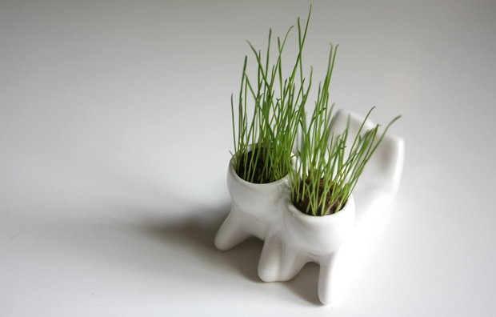
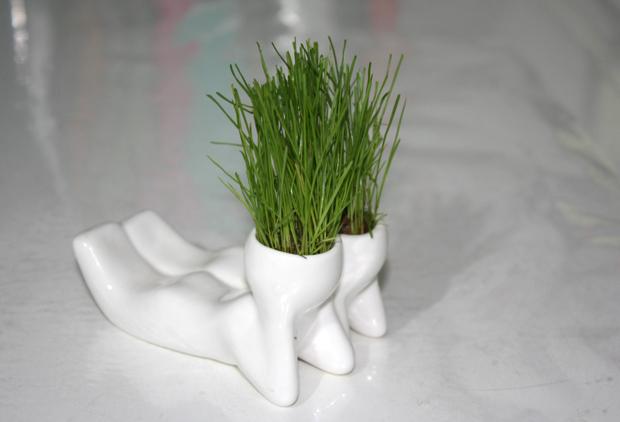
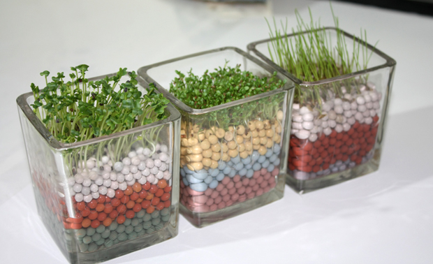
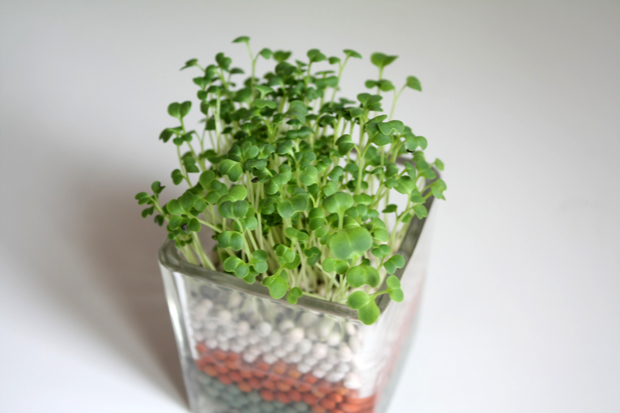
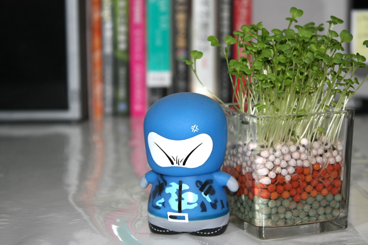
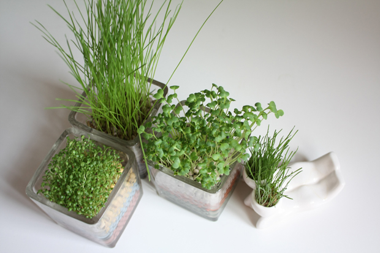

一到夏天，就会有种植的欲望。大概一年之中，夏天是最厌倦城市生活的，总想着跟大自然更近一点，跟绿色更近一点。前几天看香港电台的铿锵集，里边走访了一些放弃掉城市生活的香港人，在香港郊外过每日种田的村野生活，突然就很想放下现在的一切，去农村，承包下一小片田地，种自己喜欢的蔬菜水果，自给自足。 

长草小人买回第二天

长势很快

刚刚修剪完头发，还是有点乱

从左到右：心形草，晴思草，岩石草

窗户向北，小草艰难地寻找阳光

心形草长大是会开花的，只可惜这段时间天气太闷热，花还没开，草就快蔫了

全是绿的

