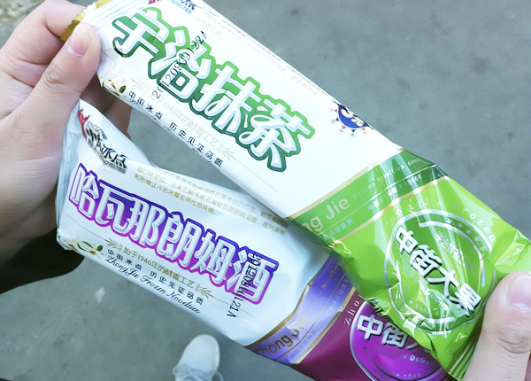
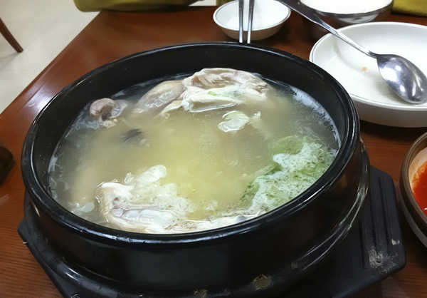

在长春的时候，走在路上很难找到一家吃东西的地方，但沈阳就不一样了，我们住的旅店背后一整条街都是吃饭的，烧烤最多，徘徊了很久，很多都想尝试，最后选了一家满族餐馆，点了三样菜，菜量平均是北京的两倍多。店里每桌人都在喝酒，让我们觉得不喝点小酒都不好意思了。 大果是沈阳中街冰点城的雪糕，很多人在门口排队，我们买了抹茶和朗姆口味的，3元一根，奶香醇厚，个头还挺大，原味的大果是没有包装的，直接冻在冰格里，交完钱直接从冰格里取出来递给你。听说这个店已经有60多年的历史，写攻略的网友说他父母当年就是在这儿吃着大果约会的，现在轮到他和女友约会了，同样的地方，同样的大果，和父母分享同样的记忆一定是很美妙的事吧。一座城市，也总该有些历经数代能留下来的东西，不一定非得是个门票昂贵的景点，像大果这样，简简单单一样小东西，多好。  路边摊的甘梅地瓜很好吃，其实就是炸好的地瓜条，蘸了酸梅粉，吃起来酸酸甜甜还有点咸，又有地瓜的香味。甘梅紫薯吃起来就不如甘梅地瓜了，紫薯的甜味始终比不上地瓜。酸梅粉吃起来有点像南方吃杨桃的时候蘸的那种粉，本身就很美味。 点评网上沈阳口味最佳的10大餐厅，除了那些北京也有的和西点面包店，剩下排名最前的就是长寿参鸡汤了。 长寿参鸡汤在西塔街附近，找进店里已经是晚上10点多，还陆陆续续有客人来喝汤。石锅端上桌，白白的汤里卧着一只小小的童子鸡，汤面上飘着葱花，鸡肚子塞着糯米，红枣和高丽参，鸡肉软烂，入口即化。东北10月的晚上已经有些寒意，这样的深夜来一锅暖暖的参鸡汤，真是舒服惬意。  来之前在网上搜沈阳攻略，除了那些我们不太感兴趣的景点，发现很多人都说到了沈阳的吃，还有个大连的网友说大连就没有沈阳那么多好吃的，当时我还很诧异，因为印象中，大连应该有不少海鲜美食的，大连人都这么说了，可见沈阳的吃还是出了名的，以至于我最后收集到的沈阳攻略全是关于吃的，细到那些犄角旮旯里藏匿的美食地图，从住地前往的交通指南等等。当然最终我们远远没有吃遍，也没啥机会和时间按图索骥去搜寻。沈阳街上最多的还是烧烤和朝韩料理，而我那两天又正好上火，不能吃辣，不能吃烤肉，没能吃到传说中正宗的韩国料理，留下点小小的遗憾。