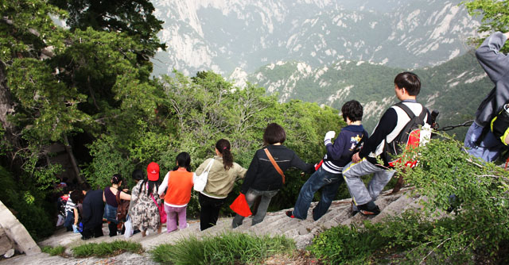

 西安之行主要的任务是爬华山。但爬华山回来后，我发现照片都照得比较一般。 其中一个原因是在路途中经常能看到的这句话——“爬山不观景，观景不爬山”，这应该是管理员用于提醒华山游客的。华山较险，其中许多地方都要手脚并用，所以挂一个相机就显得不大方便。山路也窄，人们一个接一个的，你要是一夫当关地在那站久了，自己也不好意思。另外我们全程步行，一开始还悠哉游哉的慢慢爬，到了下午才觉得要加快，所以也没太多时间瞎拍。到了最后体力透支，也没什么兴致拍照了。另外华山山顶不像峨嵋或泰山，有大片的空地，全都特别窄。大家全挤那了，日出没看着，就光看人了，更没什么好地给你拍照。 再者我感觉不管是华阴还是西安，空气不大好，感觉还不如北京。那几天，天空都是灰蒙蒙的，能见度很低。固然也就看不到白茫茫的云海，还有水墨感觉的远山。拍的照片中天空基本都是一个色——灰，没有蓝天白云，失色不少。 没有留下好看的照片，也不算太遗憾。其实眼睛看到的山还是挺不错的，而对于爬华山来说，最重要的是过程。我想今后很难再会想全程爬一次华山了，实在太累。哪怕你选择坐索道，也只是到达北峰而已。要到另外几个山顶还是要费不少体力。心里觉得趁年轻来完整爬一次还是挺明智的选择。 爬华山过程中最值得买的是手套，华山虽险，很多地方要手脚并用。但抓紧了慢慢爬，其实危险也不大。手套一块钱一双，是长时间抓铁链的必需品，也挺划算。其它一些在华山的消费就不那么划算了，不如吃住。因为几个山峰是连索道都没法直接到达的，所以一些吃的都是挑山工挑上去的，成本极高。我们吃个最便宜的面都收20块，随便炒个素菜都是三四十。要想不被宰，还得自己多带点干粮。但是注意，就算是买热水泡自己带的方便面，他也可能收你十块钱。 另外恰逢小长假过去，住宿也狂宰游客。一个床位一百多，没水洗澡（华山长期缺水）。我们最后一气之下找了个窑洞，条件恶劣点，五十块一晚上，总算在天黑地冻之前住下了。后来才发现已经很幸运了，因为有六个来晚了的学生，找不到地方住，最终挤在我们窑洞的最后一张空床上。这双人床大小的地方，六个大学生挤着，真不知道他们睡着了没。