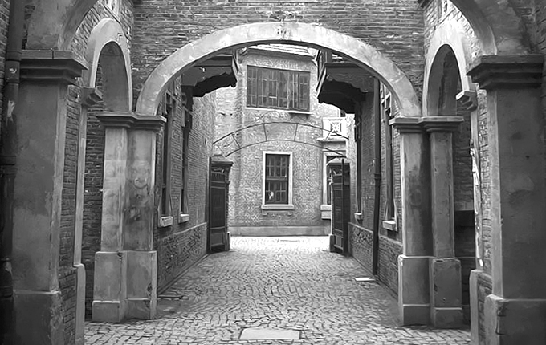

 微博上看到有朋友提到上海的石库门，和所有大城市的传统老建筑一样，石库门在上海就如同四合院在北京，已经所剩不多，剩下的也都奇货可居。 小时候有幸在上海住过一年石库门，像我这样健忘的人，对石库门的记忆其实已经有些残缺。我家住在三楼，爸妈住三楼的一间大屋，而我则住在楼顶的亭子间里，虽然那会才小学5年级，但那种一伸手就摸到天花板的压抑感觉到现在还记得。早上起床只能坐在床上，有时候会迷迷糊糊忘了想在床上站起来，结果就撞到头了。亭子间里一扇窗开向石库门的院子，另一扇就是亭子间标志性的斜天窗，那时的我，喜欢躺在床上望那一小格天空，现在回想起来才明白，原来幸福的大小跟能看到天空的大小并没有直接的关系。 亭子间跟爸妈的大屋由一小截竹梯连着，每天爬完三层木楼梯还要再爬上竹梯才能到我的亭子间。那三层木楼梯几乎是一年四季照不到光的，梅雨季节里总有挥之不去的发霉的味道，走起来又嘎吱作响。我还依稀记得二楼有扇门总是半掩着，里面黑乎乎的，每次放学回家，爬到二楼，我都会下意识的跑快几步，总担心那扇门背后会突然钻出来什么东西。后来高中时期玩《生化危机》，每次开一扇门的过场动画，总会让我想起石库门时期二楼的那扇门。 由门得名，自然石库门建筑的门楣部分是最为精彩的部分，装饰也最为丰富。可惜小时候的我对石库门最重要的这部分记忆几乎为零。对那时的我而言门就是门而已，从来不曾好好抬头多欣赏一下。只记得进门，穿过一小块天井就是一楼大厅，已经被改造成几家人共用的厨房，穿过大厅是一块不算大的院子，院子一角还有一口小池子，但那时的我很少到院子里去玩，一来整栋楼没有和我同龄的小伙伴，二来作为外来的小孩，刚到上海在学校被上海的小孩称作“乡下人”，性格上已经变得拘谨内向了很多，回到家从来就是宅在家里，很少再下楼活动。 弄堂还算比较宽，一侧有一条细细的水沟，曾经见过有些人来这里倒夜壶，我们住的石库门一楼有个茅厕，所以倒也一直没用过夜壶。但我一直不清楚水沟里的水是从哪里来的，也一直奇怪，有人往里面倒夜壶，为什么会没有异味。弄堂上空常常会挂满各家各户晾晒的衣服被子，层层叠叠，在风中招展，有时会遇上一些还在滴水的，穿行其中，总要小心避开那些水滴，就像在玩横板闪避过关游戏。弄堂口有个卖茶叶蛋的老人，也卖臭豆腐，上海的臭豆腐跟湖南臭豆腐完全不同，外表是金黄的，虽然都是闻着臭吃着香，但上海臭豆腐的臭味会相对淡些。那时我很喜欢吃弄口的那家臭豆腐，蘸上甜辣酱，想想都会流口水。 对于石库门的居住感，王安忆在《长恨歌》中描绘的淋漓尽致：一旦开门进去，院子是浅的，客堂也是浅的，三步两步便走穿过去，一道木楼梯出现在了头顶。木楼梯是不打弯的，直抵楼上的闺阁，那二楼的临街的窗户便流露出了风情。好多年没再回上海，有机会回去要去看看曾经住过的永安里附近的弄堂，不知道那里的石库门还在吗？对于儿时居住的记忆，也许只有在重游故地时，有些回忆才能更清晰的显现出来。 配图来自：[丸子](http://www.flickr.com/photos/shiroubangrevival/)