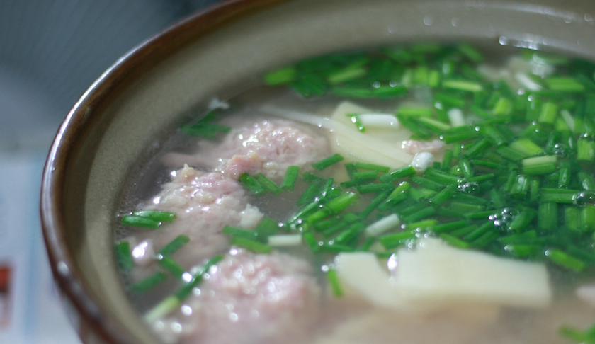

 刚看第一集《舌尖上的中国》，就被里面的冬笋馋到了。小时候很爱吃笋，特别是春夏之交的时侯，四川人家里常常会做一道苦笋肉片汤，每年一到季节，就 馋着想吃这道汤菜。奶奶每次总会做上一大锅，可以连着吃上好几顿。每顿我光是喝汤就能喝上4、5碗。爸爸爱吃苦笋，越苦越喜欢。我最喜欢找那些嫩一些，切 成梯子状的苦笋，第一口下去，是外面几层嫩笋衣清苦的味道，再嚼几口，就能尝出些甜味来。汤里滑滑的肉片通常是裹了些蛋清和淀粉的，空口吃很鲜美，我更喜 欢交替着蘸下蘸水，酱油配着现炒的辣椒，还可以直接换成椒盐辣椒面，一口刺激，一口清爽，一口鲜滑。 来北京以后，很少吃苦笋了。每年回去的 季节也不是吃苦笋的时侯，偶尔周末自己在家做饭，会突然怀念起小时候的滋味，直奔菜市，买了竹笋，回来洗干净咬了一小口嚼着很脆，却一点不苦，不过拿来煲 肉汤仍然鲜美，拿肉馅和上蛋清和淀粉，捏了10个肉丸，满满一锅竹笋肉丸汤，两个人一顿就吃光了。