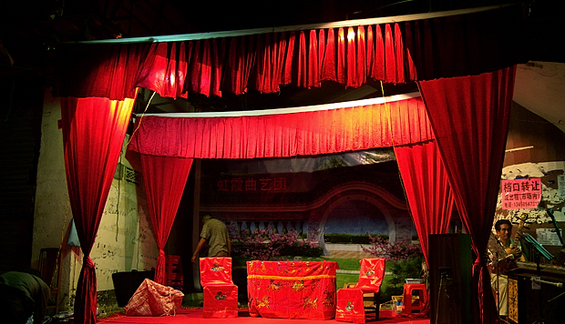
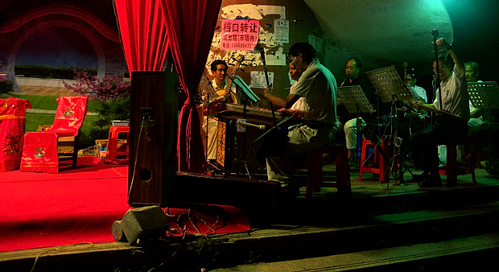

老爸这趟去湛江，本来也是打算有机会去听场粤剧，可短短几天，哪腾得出时间。 某晚走到一条老街，车多街窄，路灯也少，几乎只能靠往来的车灯照明。远看街口却有一大块暖暖的红光。走近了原来是个戏班子正在备场。台下已经坐了十几排观众，占满了整个街沿，很多都是附近的老人，穿着睡衣裤拎个马扎摇着蒲扇就出来了。这气氛，让刚开始转凉的夜晚，又热腾起来。  大红色的戏台背景幕上挂着“虹霞曲艺团”的招牌，穿厚底戏靴的演员穿行在幕前幕后忙着摆放道具。乐队已经开始暖场，京胡，三弦，扬琴，琵琶，萧笛，锣鼓，声音浑厚圆润，又层次分明，抑扬顿挫。站着听了一会儿，恍惚中有些穿越了。上前一打听，还得有半个钟头才能正式开场，又站着听了会儿，在老戏迷们诧异的目光下前前后后拍了几张照，想着还没吃晚饭，只好提前离去。 最终，这粤剧还是没听成，但静下来的时候，印象中那天的暖场音乐好像偶尔还在某个地方绕着。那日的人流，车流，灯光，在那流淌着韵味的戏乐背景下，将我浑身都浓郁了。 