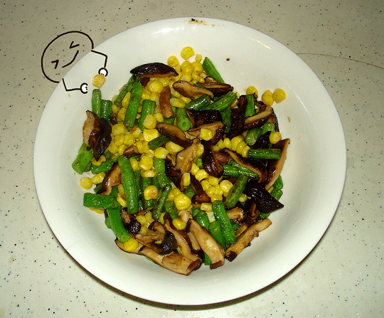

周日下了一天的雨，赖在家里不想出门，临近晚上，才想起晚饭问题。冰箱里有猪肉陷儿，鸡肉，还有爸妈带回的卤鸭子，就是没有蔬菜。看看外边阴阴的还在下雨，想到去买菜还得梳头，换衣服，穿鞋，就满脑子的不情愿。突然想到家里还有5根豆角，配上前些日子买的嫩玉米粒，干香菇，正好可以搞定一盘营养美味的素食。 20分钟泡好香菇，切成小条，豆角也切成同样长短的小段，下油锅炒到豆角变绿，再压一压让豆角充分地熟透，最后放嫩玉米，再翻炒两下，加盐和味精，鸡精，就可以起锅了。 爸妈都说味道不错，看上去也黄黄绿绿的，还有香菇点缀，想想都很营养。这该是我胡搞瞎搞出的最好看的一道菜了吧。就叫它三色炒吧。 