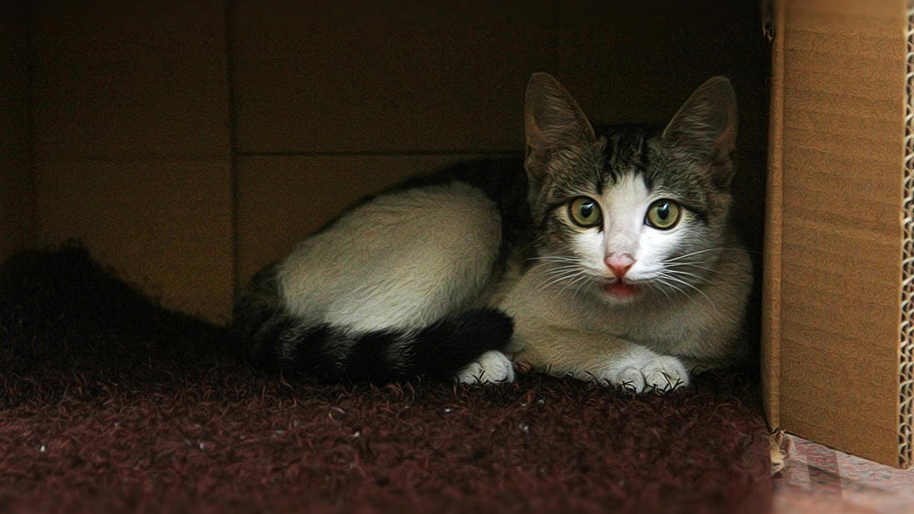
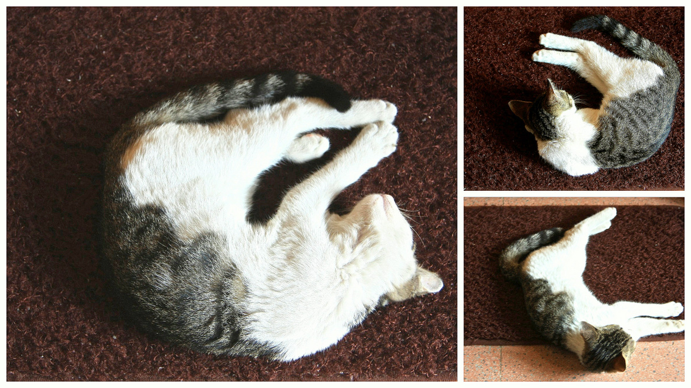

 躺在天猫箱子里的猫 6月初的一个早上，家里来了一位不速之客，一只瘦瘦的小猫。猫是坐电梯上来的，我们住在16层。那天电梯门一开，一只小猫跑了出来，蹿到走廊里，对着邻居家的门一直叫。一开始以为是邻居家的猫，后来看邻居一直没开门，又听它叫得可怜，我就把门开开了，它望了望我，我一喊它，它就跑过来，跟着我进了屋。 小猫看着很可怜的样子，很瘦，一直叫着，看起来像流浪猫，但黑白相间的毛还算干净。碾碎了半根火腿肠，放到盘子里，递到它跟前，看它安静的吃起来，一定是饿坏了。吃完半根火腿肠，小猫又开始叫。一开始我以为它还没吃饱，放进剩下的半根火腿肠，它闻了闻没吃，继续叫。于是没理它，过了一会发现它跑去厕所闻地上的水，才反应过来，它大概是渴了。于是又装了一盘水放到阳台上，召唤它来吃，果然小猫跑过来一口一口的舔起来。吃饱喝足之后，它先是跟着我在屋里到处转了转，大概是想熟悉熟悉环境，然后趴在卧室门口的垫子上打起盹来。这个垫子是家里所有地垫中毛毛最长，最软的，这个位置还能吹到风扇，实在是太会选了。看它一开始眯着眼，还四肢并拢规规矩矩的趴着，过一会就形象全无的四脚乱放了。  一开始还睡得很规矩 看着小猫可爱的样子，很想收留它，但又怕自己搞不定，以前还从来没有自己养过猫，也就小的时候奶奶家有过一只很凶的老猫，还曾经抓破了妈妈的脸。上网查了查最近的宠物医院，在两站外，但网上全是差评。如果要收留它的话，意味着要先带它去宠物医院看看，然后买猫砂和猫粮。坦白讲，这方面我一点经验都没有。而且如果现在收留它，过几天又要出门旅游好几天，没人看着不行吧。一旦收留它，我想也不能中途放弃什么的，如果将来要怀孕，是不是会有影响？啊，我是不是想太多了。看着小猫安静的睡在一旁，我真有点不舍得放它出去。但回头一想，也许放它走才是最好的呢？猫是爱自由的动物，而我只在它需要的时候能够提供给它吃的和短暂的栖息地就好了。那种因为喜欢就据为己有的想法是不是有些自私呢？人可以想很多表达很多，但你却无法知道猫真正在想什么，想要什么。也许它想要的不过就是一餐饱饭一顿饱觉而已。  拍下它的睡姿，也算是留作将来的纪念。拍照的时候，它显然是敏感的听到了快门的声音，但眼睛只是眯了眯，又睡过去了。大概它已经确定在这里不会存在危险了。能够给它提供一点暂时的安全感，我心里突然也有了小小感动的安慰。 后来，猫醒了，开始活跃起来，先是跳到电脑桌下的盒子上，我赶走它，它又跳到茶几上，又赶走它，它趴在茶几前的地毯上看着我。我想它也许需要一只盒子，于是找来前些日子天猫超市的快递箱子，开口侧着放在阳台的一角，我指着箱子，唤着小猫，告诉它这才是你的地盘。没想到小猫居然好像听懂了我的话，朝天猫箱子走过来，然后就这么钻进去了，完全没费我什么功夫。实在是太听话了，一瞬间我差点又想留下它。 就这样小猫安静的趴在天猫箱子里一下午，雨终于停了，我想下去问问门口保安，是不是有谁家丢了猫，心里想着一会带它出去，如果回来的时候它还跟着我，那我就留下它吧。锁门的时候，小猫蹲在防盗门和里门之间对着里面叫了几声。我不知道它是不是还有些留恋。进电梯的时候，我只是一招手，它就跟着我进来了。出了楼门，小猫一下兴奋起来，从这个水坑跑到另一个水坑，我想至少这个时候，它是自由的。问保安，保安说这只猫在这附近已经两三天了，一点不怕人，有人进楼门，就跟着进去了。昨天倒是有个女孩贴寻猫启示，不过是一只白色的大肥猫，没找到还一直哭。我想象着如果那个女孩捡到这只小猫会不会心生一点安慰。 回去的时候，小猫不见了，进了楼门，才发现它又躲到了电梯门口。我看着它，可惜它看上去已经不认识我了。对面的电梯到了，门一开，蹦出来一条狗，狗看见对面的猫，一下扑上去汪汪叫个不停，猫很无语的侧着头，没理它。就这样，我上了对面的电梯，那只小猫没有再跟过来。一个人吃完晚饭，心里还惦记着那只小猫。于是又下去了一趟，想着如果找到它，就再带它回来，至少让它待上一晚。结果找遍了整个院子，也没有小猫的踪影。再后来，也再没有见到过它。