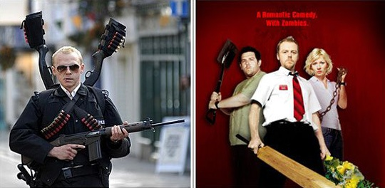

 很巧合地在两个月内看了英国导演Edgar Wright的两部电影——《僵尸肖恩》和《热血警探》，同为Simon Pegg 出演。这个顶着一颗圆脑袋，表情木纳，面部还有些不对称美的Simon，一看就让人可乐…… 《僵尸肖恩》是后看的，如果不是看见Simon露脸，我还真会以为这是一部像《活死人黎明》一样的恐怖僵尸片。虽然据说Edgar Wright很喜欢《活死人黎明》，并把这部片子当作对《活》的致敬，如果Kuso也是一种致敬的话。僵尸片看太多容易产生抗体，比如《活死人黎明》，《生化危机》系列等等，但这部片子让我的抗体失效了，因为其中的笑料让我无法免疫。小人物的英雄主义情结就在这样一个僵尸泛滥的日子Survive了。 两部片子，《热血警探》更加完美。如果排除掉恶搞成分，《热》已具备一切商业电影的成功元素：曲折紧凑的剧情，悬疑，暴力场面，还有Cult成分。甚至比好多纯类型商业片的剧情更有看点。但Edgar Wright想让你看的绝不仅仅如此，从头至尾的笑料，意想不到的包袱，绝对让你笑到血脉喷张，而且如果你看片够多的话，你会发现，整部电影有好多对不同电影元素特别是对好莱坞电影的Kuso。诸如《Bad Boys2》，《Break Point》，《Romeo & Juliet》甚至《Harry Potter》都被恶搞了一番。 英国式Kuso定有不同于其它的地方，在于它的黑色幽默。单纯的Kuso难免流于肤浅，但这两部片子在极尽搞笑的同时，还包含着更深层次的思考。因为是Kuso，有时候你还真说不准，这样那样的深刻主题是导演有意为之，把主题也一并Kuso了，还是只是导演真实想要在Kuso后表达的主题。 《僵尸肖恩》里，我们看到了卡夫卡式对于人变形为僵尸的隐喻，人等于僵尸的一种哲学思考。《热血神探》里，我们看到了当权者为了维护表面的和平而恣意屠杀不谐和者的罪恶行为。 或者，各取所好，你可以将它们当作对现实的讽刺，也可以当作更深层的Kuso。 Hot Fuzz里的恶搞桥段太多了，随便举几个： 1、海报就是模仿我们的小马哥嘴里含着牙签的酷样。 2、剧中有一段“You jump，I jump”这个一看就知道哈 3、英国版双枪老太婆 4、Angel和超市老板上演的奥特曼之战 5、结尾听Angel不停地说“Everything is gonna be fine”,直接想到杰克鲍尔。 另外，还有被细心的影迷津津乐道的两个彩蛋：《魔戒》导演彼得·杰克逊客串的圣诞老人和《魔戒》美女凯特布兰切特客串的Angel的蒙面女友。 最后值得一提的是《僵尸肖恩》里的众多摇滚元素，从插曲到片中一张张选择黑胶唱片作武器，以至于很多人把这部片都列入了摇滚影片的范畴。