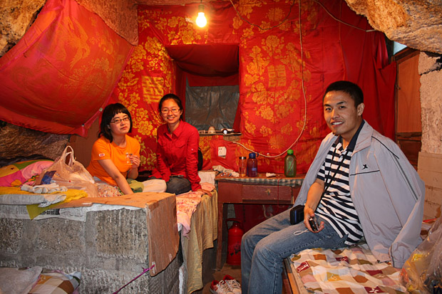

很多索道上华山的游客，过了擦耳崖，到苍龙岭就不再往上。这里有个导游都会提及的“韩愈投书处”。传说唐朝后期，韩愈被贬，心情十分不好，刚好遇到他的侄子韩湘子和华山修道士吕洞宾，二人劝说韩愈去华山一游，以解心头之闷。韩愈很是高兴地就去了。一路吟诗赞叹华山的美，谁知走到苍龙岭就一步也不敢迈了（唐时的华山，不象现在这样凿石为阶，设栏护路，履险如夷。唐时的苍龙岭不过是在“龙”的脊背上粗凿了几个石窝而已）。韩愈于是拿出随身携带的笔墨砚台，很快写好了一峰求救信扔下山去，不久，华山采药者将此信报告了华阴县令，县令既派人将韩愈救下山去。故事虽假，但看着眼前这个两边都是绝壁的苍龙岭，听着传说，很容易就浮想出古时没有石阶，没有铁索的样子，腿一下就软了，很有威慑作用。  苍龙岭，华山三险之一，也是我们唯一尝试的一险。另外两险是鹞子翻身和长空栈道，都需要栓保险绳才能去，而且也并非必经之路，最终没敢尝试。苍龙岭远远望去就像是一条蜿蜒的龙脊，宽不足一米，两边都是悬崖绝壁，爬的时候始终没敢往两边看。  东峰附近的下棋亭，需要通过鹞子翻身才能下去。所谓鹞子翻身，就是绝壁上凿出几个脚窝，游人至此必须拴上保险绳，面朝石壁，由上往下攀着铁链下去，背后就是万丈深渊，而且，由于石壁内倾，下脚的时候可能看不到，只能慢慢用脚试探。  等了好久，才见到有人通过鹞子翻身下去，通往下棋亭的路空空的再也没有其他人。去之前还想过要尝试一下鹞子翻身，最终也没有勇气下去。  南峰顶。华山的各座峰，顶部都特别窄，人全挤在一起，这座峰后面就是华山的另一处险境——长空栈道。上下皆是悬崖绝壁，铁索横悬，由条石搭成一尺宽的路面，下由石柱固定。一共三截。之间需要通过悬挂在绝壁上的铁索上下到另一段栈道上。游人都挤在最上面入口处，真正下去的没几个。  本打算夜宿西峰宾馆，没想平日30一张床的9人间也涨到了100一张床，最可恶的是接待员态度恶劣，我们四个人只给我们一壶水，一气之下，住到了中锋一处道观的窑洞里，50一人。住窑洞也算是感受了一回陕西的特色。我们两个女生坐的这张大床后来被六个年轻人霸占了，六个人横着躺了一宿。