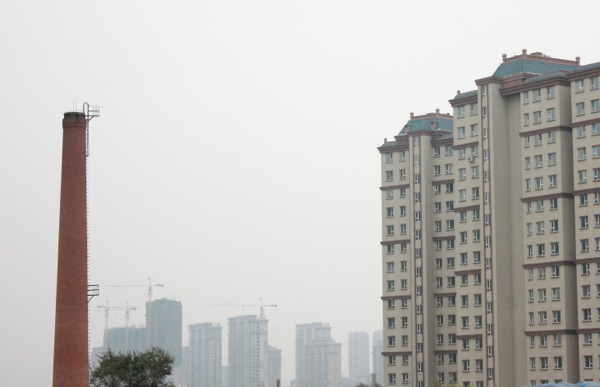

 我们的一日暴走从文化广场开始，往南沿着新民大街，想把伪满八大部的旧址都逛遍，这里大多旧址都变成了学校和医院，路上人不多，绿化很好，给人一种在南方城市的错觉。 为了找到去长影厂的路口，我们在南湖公园边上走了好久。这里有个家乐福，但我第一次见到这么空空荡荡的家乐福，就几个人在里面逛，收银台只开一个口。从家乐福出来，见到了长春最特别的一景。家乐福的外墙上密密麻麻爬满了虫，一开始我以为是蜜蜂，仔细看空中飞舞的，才发现是瓢虫。这满大街的瓢虫啊，我这辈子都没见过这么多的瓢虫。 回旅店上网查了一下，原来长春每到秋天都会瓢虫泛滥，东北人把它叫“花大姐”。有一种说法是多年前长春的森林曾经闹过虫灾，于是释放了成批的瓢虫用来对付虫灾，若干年过去了，虫灾已经消灭，但瓢虫的繁殖力很强，夏天一过，森林里没吃的，就飞到了城里。虽说长春的瓢虫大多是益虫，但这么密密麻麻的瓢虫，不得不说也是种生态灾难。  除了“花大姐”多，长春还有一样东西多，那就是烟囱。一路上都能看到高耸的旧烟囱，已经不再冒烟。据说这些废弃的烟囱大多数属于原来供热的锅炉房，后来改为集中供热之后，锅炉房停产、停用，造成烟囱的废弃，另外还有部分是因为有的小型工厂停产、停工造成锅炉房废弃。于是想起《钢的琴》里那些东北的老工厂，然后告诉自己，这就是东北。 长春整个给人感觉旧旧的，在长影厂附近的地方，本来希望有些可以逛的小店，比如电影书店之类，结果什么也没有。长影厂也在修，门口保安推荐我们去长影世纪城，但我知道那不过是个模仿迪士尼的游乐园，我们期待参观的长影厂，不应该是个游乐园的感觉。带点遗憾的，我们很快发现没地方可以去了，只好去了郊区的净月潭，在那儿花了一整个下午的时间，租了辆双人自行车，上坡下坡，就当锻炼了。 若干年后，我可能早就忘了长春的街道，但应该会记得长春的“花大姐”和旧烟囱。