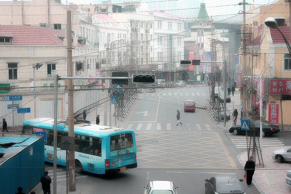
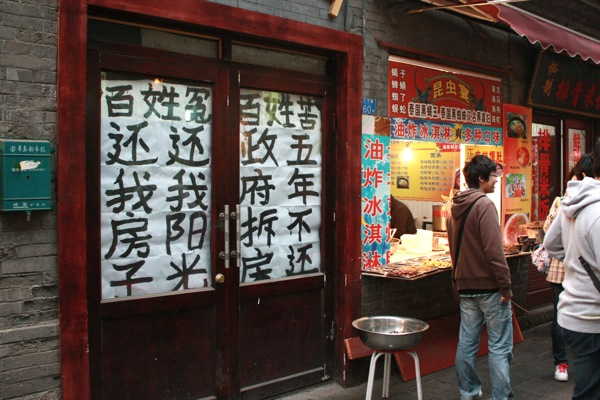

3天的假期选择来青岛，一来动车高铁能够快速到达，省去路上不少时间，二来是前些年在豆瓣看到一个青岛的相册，当时就被相册里的青岛街道吸引了，干净，小斜坡，大转角，爬山虎，老房子是那个相册传达给我们的青岛印象，虽然在那之前我已经去过一次青岛，但毕竟是出差，唯一的自由时间都被同事拉去海边了，没机会深入那些小街道。所以这次的重点不是海边，不是海鲜，而是探寻青岛的街道。 上一次去青岛是在五六年前的样子，出差，前几日都是开会，就最后一天，和同行中唯一的女同事多留了一天，去海边逛了一圈，吹了吹海风，吃了点海鲜。只记得那天下着小雨，青岛的街道很干净，人很少，奥运帆船中心还在建设中。 这一转眼奥运都过去好些年了。到青岛已是下午两点，火车站附近在修地铁，交通比较混乱，之前量过地图，从火车站到我们住的7天，也没多远，于是就沿着中山路走，想顺路找家馆子把午饭给解决了。 青岛的中山路，在历史上的地位，相当于北京的王府井，上海的南京路，有上百年的历史，这条商业街最初是在德国占领时期开始修建，当时德国人为了从栈桥运输物资，在1899年修建了中山路，是青岛市第一批城市道路，当时分南北两段，南段自栈桥至德县路口，到处是洋行、咖啡馆、酒吧、舞厅和旅馆，蔓延着浓郁的异国风情；北段自德县路口到大窑沟，属中国人居住区域，汇集了各类民营商号、传统饮食，里院里弥漫着吃喝杂耍的市民气息。后来中山路又经历了日本占领时期，留下了不少日式建筑。  但让我没想到的是，中山路上人并不多，不像永远熙熙攘攘的王府井和南京路，两边虽然也是鳞次价比的商铺，商铺门前往往都挂着某某旧址的牌号，但整条街除了一些和我们一样的游客之外，逛街的并不多。经过后来两天的暴走，我们才发现，在青岛，旅游的都在海边，拍婚纱的不在八大关就在海边，逛街的都在台东，除此之外，什么中山路，香港中路，人都稀稀拉拉的，大多数地方，走在路上都感觉清静。 在美达尔吃完午饭，两个菜加烤串，硬是把我们吃撑了。那两个菜，每一份都相当于在北京吃饭两份的量。烤鱿鱼是青岛的特色，鱿鱼特别大个，从美达尔出来，路过路口的王姐烧烤，慕名而来的游客排队等着烧烤，把路口堵了个水泄不通。吃完午饭就开始下起雨来，继续沿着中山路往北，穿过胶州高架路，再穿过馆陶路德国风情街，人越来越少，路越来越窄，在一片老房子当中，终于看到7天的黄色小楼。 下午先去了德国风情街，再逛到即墨小商品市场，边上一栋民居楼，挂着横幅，写着“挡光侵权，侵害百姓”。到劈柴院的时侯，已经是傍晚了，整条中山路，属这里人最多。这里相当于是王府井小吃街，但要短很多，尝了个海胆，10块一个，原来只是拿海胆装着的蒸蛋。有家“国足”臭豆腐，貌似很知名的样子，排满了人，但旁边不远处却有一家民居，门前贴着“百姓冤百姓苦，政府拆房五年不还”。然后就又下雨了。路过天主教堂，发现在维修，往南一直走到栈桥，雨下大了，风更大。我们就这样撑着把破伞，沿栈桥走到廻澜阁，遭遇了我这辈子遇到的最大的风。其实去之前豆瓣上已经有朋友提醒过我们，说这个季节去青岛，到处都在修，而且风大，让我们5月再去还可以看樱花。但我们还是等不及了，感受了一把最真实的青岛。  晚上在春和楼吃饭，是中山路上一家老字号的餐馆，一进门挂满了各界名流来店用餐的照片。这里的设施确实很有年头了，有一种年久失修的落寞感。老实讲，菜品的口味还是不错的，可惜服务实在是差，等了半天没人来收拾桌子，上菜就更是慢了，一问服务生，说大堂就他一个人负责，根本忙不过来。没办法，只能一边等着上菜，一边看着窗外雨中繁华不再的中山路，想象着当年的繁华和如今的几分萧条。