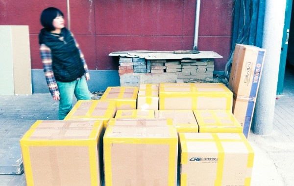

 最近听说一个词，highmover，指的大概就是像我这样从年轻时就离开自己的家乡，出去看外面的世界，然后，大学，工作，也一直在更换城市的一类人。回想自己小学的时候就已经离开四川去上海，大概就是那时候开始注定了自己不安于一个城市的命。第一次去到陌生的城市，小小的我已经体会到大城市对人特别是外乡人的疏离感。又因为离开得太早，小学毕业回四川的时候，老家这个词也并没有多强烈的亲切感，反而看到周围那些从小玩到大的同学朋友，也会有小小的疏离感。故土于我好像只有一些人和事的记忆，始终没能撩拨起宣传片广告片上触动泪点的情绪。以前都把这些归为自己记性差，现在想来更多该是从小就离乡背井的缘故。 北京算是待过最久的一个地方。毕业后顺利拿到户口，好像可以用所谓新北京人的身份开始生活了。但一年年过去，一直没觉得这是属于我或者我该属于的地方，从小就有的疏离感一直存在。从万寿路，到十里堡，从万寿寺，到和平里，在北京也换了不少住所，好像从来就更适应这种房客的身份。这样很好，加上工作的地方，诺大个北京城到处都是自己曾经生活过的印记。 说起来在上海也住过好几个地方，沙市二路，永安里，茂名路，都只剩下模糊的印象了，在完全忘记之前应该再回去看看，不知道还能不能找到当年住过的石库门亭子间。