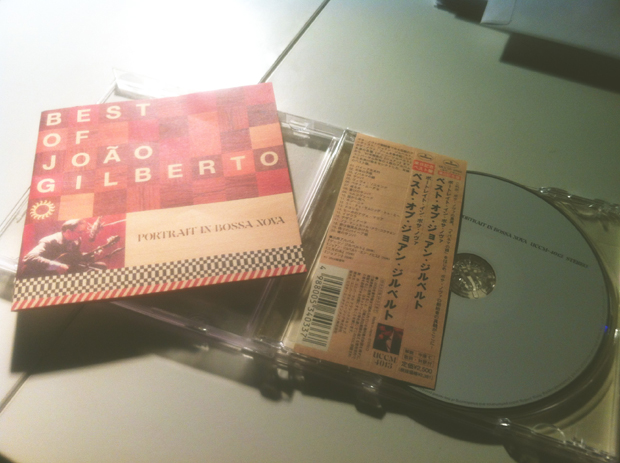

周末上完midi课，回来路上在蓝线淘到一张Joao Gilberto的CD——《Best of Joao Gilberto：Portrait of Bossa Nova》。没想到今天Gmail里就收到王老师的邮件，推荐了两张专辑《Gypsy.Caravan吉普赛之旅》和《Getz/Gilberto》，而后者正是著名冷爵士乐手Stan Getz和有着"Bossa Nova皇帝"之称的巴西歌手Joao Gilberto，还有巴西著名作曲家"Bossa Nova之父"Antonio Carlos Jobim合作的作品。 买的这张CD里当然也有著名的《the Girl from Ipanema》，这首歌当时还在我们的电台第六期放过另一个版本。 