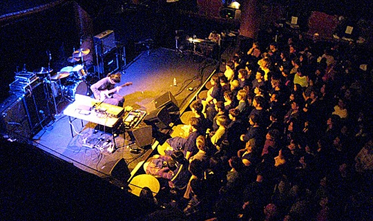

> 看着封面上那个由Fukaya Etsuko绘画的黑白色彩孤寂無助少女，可能你会问现实生活日复日地已经足够多悲惨伤痛，为什么还要再去听World's End Girlfriend这种悲情的音乐？我的答案是，即使你是悲观的人，最起码你不是孤独的，因为还有Katsuhiko Maeda在你耳边演奏，在你身边和你一起拥抱孤独。

又是去年过时的一张专辑。听音乐经常是沦为工作或者打游戏的附属娱乐，也许是这样，当初听的时候可能由于一丝的吵杂刺耳影响了工作的感觉，于是便关掉了。这两天又无意翻出来听听World's End Girlfriend的[《Hurtbreak Wonderland》](http://www.douban.com/subject/2033273/)。实在让我抑制不住内心的感动。前田胜彦的音乐功底在这张专辑里表现得淋漓尽致，我实在对这位“计算机音乐家”佩服得五体投地。并且对于这张专辑，如果没有好的音响效果，还真是有遗憾。 这一个人弄出的如此精致又宏大的音乐，是多么让我佩服和羡慕的一个状态啊。音乐和这一人乐队的名字一样，如此的悲凉，又有末世情意结。但希望有幸能听到这张专辑的人们，都能找到里面的一丝暖意。不管在聆听的过程中，回想到了多少关于自己的悲伤，不幸，痛苦，我相信这张专辑还是一张很能慰籍人的专辑，而不是让人去自杀。 如果真有世界末日，那天，还能有女朋友陪着你，应该还是不错的吧。 PS： 1. 最近眼见耳闻的惨事也太多了，在这个环境下也不知道说些什么，正如开篇引用的MCB的话所说，能有这样的音乐出现，也是很不错的一件事，自己是弄不出这样的音乐的了，而这些艺术家的存在，让我们感到没那么孤独。还是祝福那些需要祝福的人吧。 2. 博客好久没更新了，阿里妈妈的一位同学和我说，你们加油建站吧。这样的网站是不会有人来打广告的。我说:都无所谓的。正因如此，也很感谢还会来看看的朋友。我每天在博客统计里看着这些IP，也不知道都是些什么朋友。写完了，突然发现，今天刚好是个特殊的日子。 