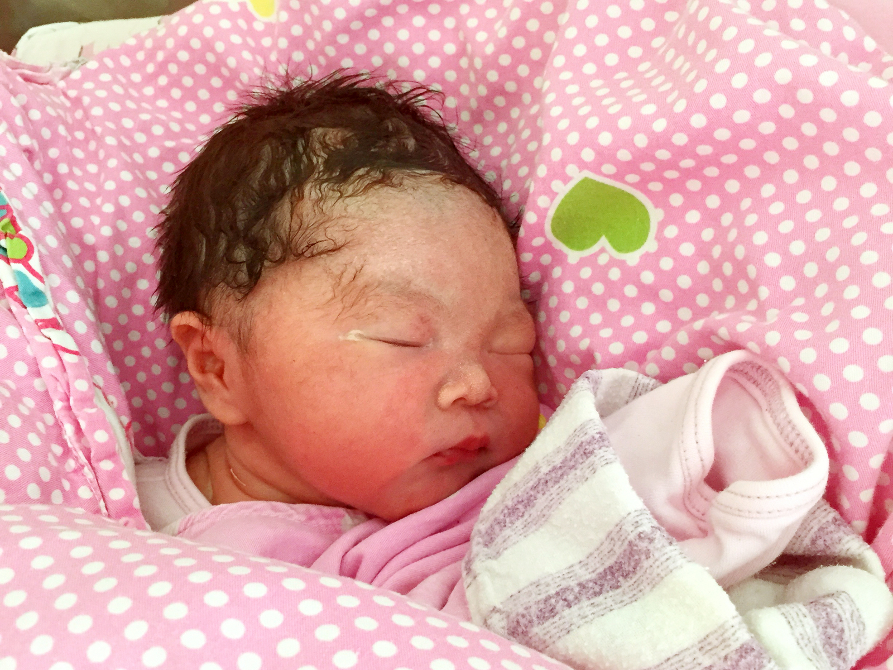
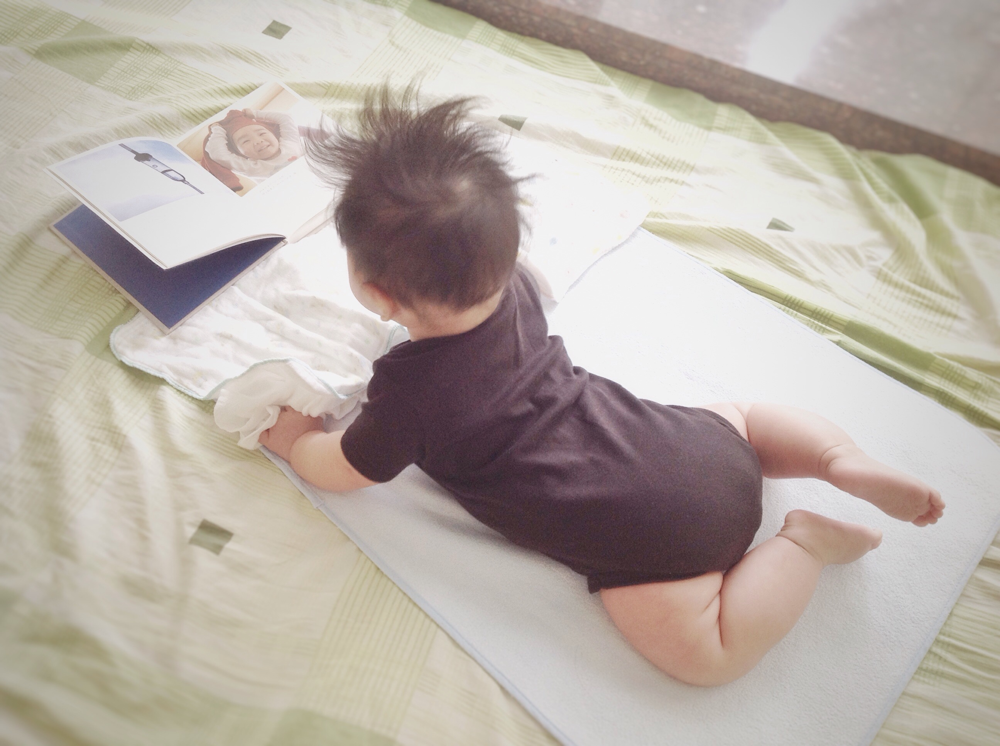
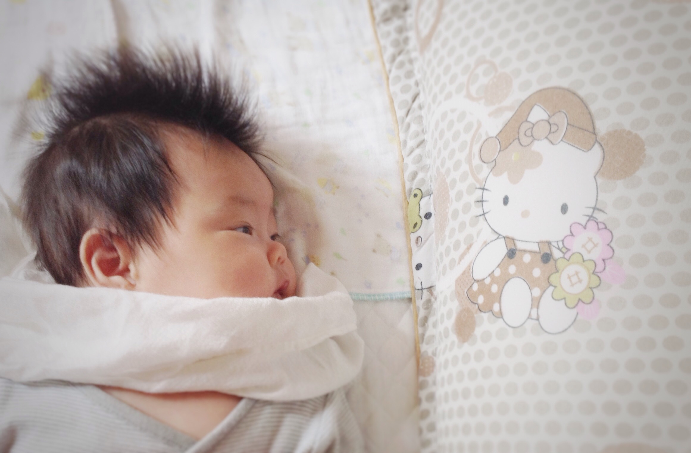

##2015-04-26
这是我出生的前一天，妈妈，爸爸，和奶奶一起出去散步。

##2015-04-27 中午11点34分
我从妈妈的肚子里出来了。比预产期整整提前了二十多天，把爸爸妈妈吓坏啦。出来的时候是5斤7两，医生说在早产儿里算挺健康的啦。
 

##2015-05-08
据说今天是世界微笑日，我也来练习一下微笑。虽然现在的我还不太明白微笑的含义，但看见爸爸妈妈的微笑就会有温暖的感觉。我对世界微笑时，世界也会对我微笑吧。

##2015-05-13
来看我的新装备--拳击手套！我的手指甲这周长得飞快，不小心在自己的脸上划出了一条红印子，爸爸妈妈想给我剪指甲了，可医生在出院前特意叮嘱要等我满月了才能剪，大概是怕剪破我娇嫩的小手吧。于是妈妈就给我套上了这双蓝色的小手套，是不是很像拳击手呀：）

##2015-05-15
昨晚实在太困了，十点多醒来后，爸爸陪我玩了半个小时，然后我就饿了，喝完neinei，又吐了好多奶，肚子还是不舒服，妈妈说是肠绞痛，不过每次都是使劲把粑粑拉出来就舒服啦。12点多换完尿片，整个人都舒畅了，很快我就睡着了，一睡就睡到了5点半，这还是我第一次睡那么长时间。爸爸妈妈也得以睡了个整觉。

##2015-05-24
还有几天我才满月，不过今天是礼拜天，大家约好了今天一起来看我。来的有婶婆，叔叔，姑姑和姑姑的男朋友。我们去家对面的酒楼吃饭，这还是我第一次出门！可是我从出门就开始睡，一直到吃完回到家里。

##2015-05-29
从出生到现在，我一直没有用过奶瓶，都是妈妈亲自喂我。如今我已经满月了，妈妈担心她要是上班，我不愿意用奶瓶的话就会饿着，所以想尽早训练我慢慢接受奶瓶。看来她完全不用担心这一点。今天第一次用奶瓶喝奶，觉得很轻松，一下就喝完了40ml，还意犹未尽。不过妈妈说奶瓶虽然方便轻松，却没有妈妈身体上的有益细菌，这些细菌可以有助于我肠道的发育。

##2015-06-24
今天我去打了出院后的第一针预防针--乙肝疫苗第二剂，因为黄疸的缘故推迟了将近一个月。打针的时候我只哭了一下下，比其他打针的哥哥姐姐都要坚强。虽然是台风天，泓景家园的社区医院还是挤满了人，排了半个小时的队才轮到我。和之前几次出门一直睡觉不同，今天我终于睁眼观察起周围来，真是个嘈杂的世界啊。回家的时候我还第一次坐了公交车。

##2015-06-27
两个月生日。

##2015-07-06
不知什么时候开始我的小床上已经堆满了玩具，而我最喜欢的还是我左手这只小驴子。

##2015-07-24
第一次搬家，从海珠到天河，从珠江南到珠江北。一整天都没怎么睡。新家很安静，可以好好睡觉了。今天我还学会了吃拳头，两只手轮换着吃。

##2015-07-27
今天我满三个月，也是我住进新家的第二天，可我却感冒了，有些流鼻涕，不过我一定会很快好起来的。

##2015-07-31
腰鼓不应该是挂在腰上的么？妈妈，你怎么把它垫我脖子下了。

##2015-08-05
妈妈：今天娃满百天了 
爸爸：有什么庆祝？ 
妈妈：不知道哦，正在喝奶 
爸爸：多喝点奶庆祝下

##2015-08-12
短短三个月我就去了三家不同的社区医院打预防针，一开始在赤岗，后来去了琶洲，现在又转到了东晖。今天是搬家后第一次打预防针，第二针五联，到医院很多人夸我头发长得漂亮。做保健时，儿保医生说我长得不错啊，还说妈妈的奶好。不过这两天妈妈开始训练我喝奶瓶，可是妈妈在家我真不想喝奶瓶呀，还是在妈妈怀里舒服。

##2015-08-17
经过两周的腿腿抬高高和向左边使劲侧的努力，今天我侧身时上面的一条腿终于越过了下面那条，能够保持侧着身子的动作不晃荡了，接下来我要向翻来趴着努力啦。

##2015-08-24
第一次在小车上睡着。我的招牌动作：招财猫。

##2015-09-01
9.1是小朋友们开学的日子，今天我也成功升级学会翻身啦！虽然我本来是迷迷糊糊向右翻找奶吃，但终于还是靠着自己的力量翻来趴着了，就是右手摆得不舒服，不过一翻过来我就清醒了，妈妈在旁边给我加油，我使劲挪了挪，小手终于舒服了点，但重心不稳，很快我又翻回去躺着了。

##2015-09-14
惬意的午后阅读时光
 

##2015-09-15
和好伙伴小怪兽一起在沙发上小憩片刻。

##2015-10-13 流畅翻身 

##2015-10-14
昨晚迷迷糊糊向右翻身想喝奶，一不留神就翻过去趴着了，只好迷迷糊糊用胳膊撑起来。从这以后，就开始停不下来啦。一旦尝试翻身，总是很溜地就翻过去了。半夜也想翻，还好被妈妈及时制止了。

##2015-10-23 趴着抓东西 

##2015-10-24 趴着吃手 

##2015-10-30 趴着翻回来,可以连续翻身了

##2015-11-07
人生第一次吃了奶以外的食物，毫无障碍。

##2016-01-06
第一次连续两天晚上自主入睡，妈妈说值得庆贺。虽说每次也需要喝得饱饱的，抱起放下好几次再折腾上一小会儿才能睡着，但妈妈说已经是很大的进步了。昨天开始减少了辅食量，晚上夜醒也从前一阵的5、6次变成了2次，看来晚上睡得不安稳跟前一阵辅食吃太多有很大关系呢。

##2016-06-11
终于学会走路啦！第一次一个人稳稳地走了10步，终于学会了慢慢移动脚步，掌握平衡，不再像以前一个劲往前冲，走个两三步就摔。

##2016-06-17
很久没叫妈妈，今天吃饭的时候妈妈去了厨房，想让妈妈抱，就脱口而出了“妈妈”，后来想喝奶又叫了几次，晚上睡前妈妈让我叫妈妈再喝奶，想到吃奶这么重要的事，赶紧又乖乖地叫了一声妈妈。

##2016-06-27
今天我14周，突然就走得特别溜了，从客厅地垫上很容易就走出来了，走到饭桌，走到五斗柜，走到电饭煲那里，还走到餐桌旁的食品箱那里翻了一袋未拆封的零食，拿着指房间的方向，要拿去房间吃。这下活动空间一下就大了。晚上吃饱nei'nei，我翻来翻去玩了一会儿，咿咿呀呀说了一会话，然后自己睡着了，刚好9:30。妈妈说这是14个月的惊喜。

##2016-07-14 今天学会了叫nei nei，一想到nei nei就感觉很幸福。

##2016-07-16
枕头上的Hello Kitty总是看不厌呐。是不是女孩子都爱这只猫呢？
 

##2016-08-04
夏日炎炎真好眠。

##2016-08-05
最近吃饭总喜欢站起来，一起来还发出得意的声音，嗷嗷或者哦哦叫一两声。妈妈会告诉我要坐下来才有饭饭吃，这在我想吃饭的时候还是很管用的，所以一旦我怎么都不肯坐下了，那也说明我已经吃饱了，那么是时候把我抱下餐椅了。最近几天走得很快了，也不容易摔倒了。

##2016-08-12
学会了说“泡泡”，还有“8”。正在学习说“扣扣”。昨天进厨房的时候我一屁股坐到了地上，妈妈赶紧拉我起来说地上脏脏不可以随便坐，今天我记住了，看妈妈又在厨房做饭，我就搬了小板凳过去，但还不会放，也还不会坐上去，只是绕着凳子转圈圈，最后还是扶着凳子坐到了地上。

##2016-08-17
学会帮妈妈做家务啦。

##2016-08-23
如果不算刚出生在医院里那几天游的泳，这是我第二次游泳，一开始还是很害怕，从脚接触到水就开始哭，后来阿姨和妈妈给我很多玩具，我才慢慢适应了，就在水里飘着，很悠闲。游泳结束后的波波池才是我的最爱。 

##2016-11-16
这是我第一次喝椰汁，味道好极啦。
 

##2016-11-17
妈妈给我吃蓝莓，我吃了一口有点酸，就吐了出来，看见完整的一颗蓝莓从我嘴里吐了出来，真好玩呐。我于是一发不可收拾，吃一颗吐一颗，从碗里拿起来，放进嘴里，吐到围兜里，再从围兜里一粒一粒捡起来放嘴里，吐到碗里，如此循环往复，乐此不疲。